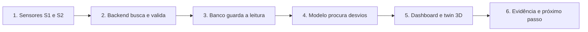
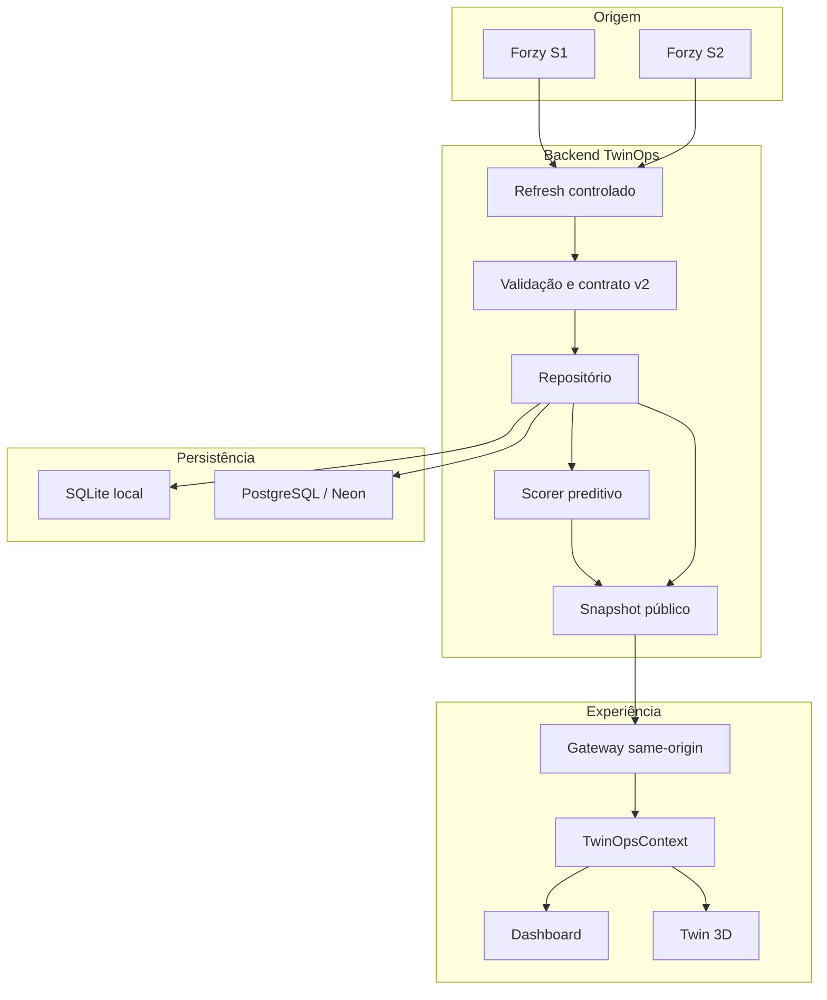
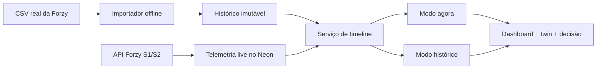
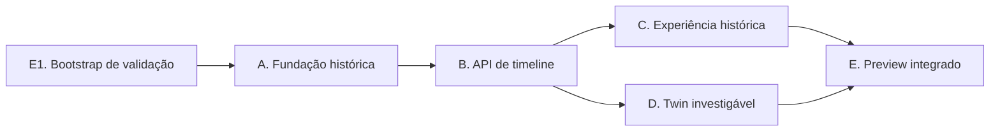

# Forzy TwinOps

**Digital Twin para manutenção preditiva de motores elétricos industriais.**

Projeto desenvolvido para o Challenge FIAP × Forzy.

> **Em uma frase:** o TwinOps busca dados reais dos sensores S1 e S2, organiza
> essas leituras, procura desvios e apresenta o estado do conjunto motor-bomba
> com evidências, histórico e próximos passos claros.


## Entenda o projeto em 30 segundos

| Pergunta | Resposta curta |
| --- | --- |
| Qual problema ele resolve? | Ajuda a perceber mudanças no comportamento do equipamento antes que a informação se perca ou a falha aconteça. |
| De onde vêm os dados? | Dos endpoints reais S1 e S2 da Forzy e, na evolução histórica, de um CSV real fornecido pela empresa. |
| O que o sistema faz? | Valida, registra, compara com o comportamento histórico e transforma leituras em contexto operacional. |
| O que o usuário vê? | Estado do ativo, sensores, gráfico, avaliação preditiva, saúde da integração e twin 3D. |
| O sistema confirma falhas? | Não. Ele aponta desvios e evidências para revisão técnica. |
| O projeto está pronto? | O fluxo live real funciona. A linha do tempo unificada e o twin histórico interativo estão em implementação. |

## A jornada de uma leitura



Em termos simples:

1. Os sensores disponibilizam velocidade de vibração, aceleração e
   temperatura.
2. O backend busca os dados sem expor a API da Forzy ao navegador.
3. Cada leitura é validada e armazenada com origem e horário de recuperação.
4. O modelo compara a janela recente com o comportamento histórico conhecido.
5. A interface mostra o mesmo estado nos cartões, gráficos e twin 3D.
6. O usuário recebe evidências e um próximo passo, não um diagnóstico inventado.

## O que existe hoje

| Parte | Estado | O que entrega |
| --- | --- | --- |
| Coleta S1/S2 server-side | Disponível | Busca controlada dos endpoints reais da Forzy. |
| Contrato canônico v2 | Disponível | Dados com formato, unidades, origem e qualidade consistentes. |
| Persistência | Disponível | SQLite local e PostgreSQL/Neon no deploy. |
| Modelo preditivo | Disponível | Baseline clássico com artefato e hashes verificáveis. |
| Dashboard operacional | Disponível | Ativo, sensores, tendência, avaliação e saúde da integração. |
| Twin 3D | Disponível | Visualização do conjunto com fallback seguro. |
| Histórico CSV imutável | Em implementação | Lotes auditáveis, reconstrução do arquivo e ativação controlada. |
| Timeline `now/historical` | Planejada após a fundação histórica | Navegação conjunta pelo histórico e pelas leituras live. |
| Twin 3D sincronizado com o tempo | Planejado | Contexto visual correspondente ao instante selecionado. |
| Preview integrado final | Pendente | Prova completa em Vercel com gates e evidências. |

## O que o usuário vê

O dashboard atual responde a cinco perguntas:

1. **Qual ativo estou observando?**
2. **Qual foi a última leitura conhecida de S1 e S2?**
3. **Os dados chegaram agora, são antigos ou a janela está fechada?**
4. **Existe algum desvio que merece revisão?**
5. **A integração está funcionando?**

Todos os componentes leem o mesmo snapshot por meio do `TwinOpsContext`.
Assim, cartões, gráfico, avaliação e 3D não exibem estados contraditórios.

## Como o sistema funciona hoje



### Quem é a fonte da verdade?

- **No backend:** o banco guarda as leituras e o último estado conhecido.
- **Na API:** o snapshot reúne telemetria, avaliação e saúde da integração.
- **No frontend:** o `TwinOpsContext` distribui o snapshot validado.
- **No modo histórico futuro:** o instante selecionado ficará fixo, mesmo que
  novas leituras cheguem em segundo plano.

### Quando os endpoints atualizam os dados?

Os endpoints S1 e S2 da Forzy operam com atualização periódica dos dados em:

```text
segundas, terças e quartas-feiras
12:00 até 14:00
fuso America/Sao_Paulo
```

Essa janela descreve quando a origem atualiza os valores, não apenas quando o
endpoint pode ser acessado. O TwinOps acompanha essa mesma janela para buscar
novas leituras. Fora dela, informa `expected_idle`. Se existe uma leitura
anterior, pode mostrar `last_known`. Se nenhuma leitura foi persistida, informa
`unavailable`.

## O que significam os principais estados?

| Termo | Significado simples |
| --- | --- |
| `received_now` | Uma leitura foi recuperada nesta janela. |
| `last_known` | O sistema mostra a última leitura real persistida. |
| `expected_idle` | A janela de coleta está fechada. Não significa falha. |
| `unavailable` | Ainda não existe leitura real disponível. |
| `normal` | O baseline não encontrou desvio relevante nessa janela. |
| `watch` | Existe um desvio que merece acompanhamento. |
| `alert` | Existe um desvio persistente prioritário para revisão. |
| `insufficient_data` | Os dados não permitem uma avaliação confiável. |
| `staged` | Um lote histórico foi validado, mas ainda não está público. |
| `active` | É o lote histórico usado pela timeline pública. |
| `superseded` | Era ativo e foi substituído de forma controlada. |

## O que o TwinOps não afirma

O projeto separa evidência de certeza operacional:

- score não é probabilidade de falha;
- `alert` não é falha confirmada;
- o sistema não calcula RUL, ou vida útil remanescente;
- o sistema não atribui causa raiz a motor, bomba ou acoplamento;
- S1 e S2 não recebem posição física fictícia no modelo 3D;
- dado ausente nunca é convertido em zero;
- uma lacuna histórica nunca é preenchida por interpolação silenciosa.

## Arquitetura-alvo: histórico unificado

O próximo salto do produto é permitir que o usuário navegue pelo passado sem
misturar dados históricos e live na persistência.



### O que muda para o usuário?

| Hoje | Com a timeline unificada |
| --- | --- |
| O dashboard mostra o estado atual e uma cauda recente. | O usuário poderá navegar por todo o período disponível. |
| O refresh atualiza o contexto exibido. | No modo histórico, o instante escolhido ficará fixo. |
| O gráfico usa o histórico live persistido. | O gráfico mostrará histórico CSV e live com origem visível. |
| O twin representa o snapshot atual. | O twin acompanhará o instante histórico selecionado. |
| Lacunas aparecem apenas como ausência de leitura. | A timeline mostrará segmentos e lacunas explicitamente. |

O CSV e o live continuarão separados. A unificação acontece apenas na camada
de leitura visual, com proveniência e qualidade preservadas.

## Roadmap de implementação



| Plano | Entrega principal |
| --- | --- |
| A | Contratos históricos, migration 003, repositórios e administração segura. |
| B | Timeline, segmentos, gaps, contexto e avaliações causais. |
| C | Provider `now/historical`, gráficos, tabela e suporte à decisão. |
| D | Seleção 3D, foco, inspetor lógico e sincronização temporal. |
| E | Preview protegido, testes E2E, revisão e evidência integrada. |

Use estes documentos como fonte de verdade:

- [Especificação Unified History + Interactive Twin](docs/superpowers/specs/2026-08-22-unified-history-interactive-twin-design.md)
- [Índice de execução e dependências A–E](docs/superpowers/plans/2026-08-22-unified-history-interactive-twin-execution-index.md)
- [Ledger formal de aceite](docs/verification/unified-twin-acceptance-v1.md)

O ledger define o estado formal. A existência de uma branch ou arquivo local
não significa que uma fase foi concluída, revisada ou integrada.

## Mapa das tecnologias

| Camada | Tecnologia | Papel no projeto |
| --- | --- | --- |
| Interface | React 18 + Vite 5 | Renderiza dashboard e controla o estado visual. |
| Gráficos | Recharts | Mostra tendências de telemetria. |
| Twin 3D | Three.js + React Three Fiber | Exibe o conjunto motor-bomba. |
| API | FastAPI | Expõe snapshot, refresh, histórico e saúde. |
| Contratos | Pydantic + AJV | Rejeita dados incoerentes nas duas fronteiras. |
| Persistência local | SQLite | Desenvolvimento, testes e provas locais. |
| Persistência remota | PostgreSQL/Neon | Banco usado pela função no deploy. |
| ML | NumPy, Pandas e scikit-learn | Features, baseline, backtest e scorer. |
| Hospedagem | Vercel | Entrega a SPA e a função Python no mesmo projeto. |
| Testes | pytest, Vitest e Playwright | Valida backend, frontend e jornadas completas. |

<details>
<summary><strong>Ver endpoints e contratos</strong></summary>

### API pública atual

| Método | Rota | Responsabilidade |
| --- | --- | --- |
| `GET` | `/api/v2/assets/{assetId}/snapshot` | Devolve o estado operacional atual. |
| `POST` | `/api/v2/assets/{assetId}/refresh` | Executa uma coleta S1/S2 autorizada. |
| `GET` | `/api/v2/assets/{assetId}/history` | Devolve leituras live persistidas. |
| `GET` | `/api/v2/integration/health` | Devolve saúde sanitizada da integração. |

O backend e o frontend validam o contrato v2:

- Pydantic em `services/twinops/src/twinops/contracts/v2_models.py`;
- JavaScript/AJV em `src/contracts/twinV2.js`;
- projeções públicas separadas da representação persistida;
- hashes externos para manifesto e artefato ML;
- erros públicos sem DSN, credenciais ou payload bruto.

O navegador não chama diretamente a API temporária da Forzy. O gateway usa
rotas same-origin em `/api`.

</details>

<details>
<summary><strong>Ver persistência e modelo preditivo</strong></summary>

### Persistência live

O repositório v2 registra:

- payload bruto recebido;
- leitura canônica validada;
- última leitura por sensor;
- estado de saúde da integração;
- ciclo e resultado de cada tentativa de refresh.

As implementações são:

- `SQLiteTelemetryRepositoryV2` para desenvolvimento local;
- `PostgresTelemetryRepository` para Vercel/Neon.

O deploy exige uma `DATABASE_URL` pooled, com TLS e exatamente um `sslmode`
seguro.

### Histórico imutável

A arquitetura histórica usa tabelas separadas para:

- lote importado e bytes exatos do arquivo;
- linhas brutas com offsets e hashes;
- amostras históricas S1/S2;
- avaliações causais por janela;
- política de coleta versionada.

Um lote entra como `staged`. Uma operação separada o promove para `active`.
Somente o lote ativo participa da timeline pública.

### Modelo preditivo

O caminho crítico usa ML clássico e determinístico:

- baseline robusto;
- features temporais versionadas;
- backtest walk-forward;
- artefato carregado após validação de hashes;
- estados públicos fechados e auditáveis.

Sem os três anchors `TWINOPS_ML_*`, a API continua funcionando e informa que
a avaliação está indisponível.

</details>

<details>
<summary><strong>Ver estrutura do repositório</strong></summary>

```text
forzy-twinops/
├── api/
│   └── index.py                 # entrypoint ASGI da Vercel
├── contracts/                   # JSON Schemas compartilhados
├── artifacts/ml/real-forzy/     # artefato e manifestos ML
├── docs/
│   ├── deploy/                  # preview, Neon e rollback
│   ├── superpowers/             # especificações e planos
│   └── verification/            # ledger e evidências
├── services/twinops/
│   ├── migrations/              # migrations do banco
│   ├── src/twinops/
│   │   ├── api/                 # FastAPI e rotas
│   │   ├── contracts/           # modelos Pydantic
│   │   ├── ingestion/           # adapters e refresh
│   │   ├── ml/                  # features, scorer e backtests
│   │   ├── research/            # experimentos públicos
│   │   └── storage/             # SQLite e PostgreSQL
│   └── tests/
├── src/
│   ├── components/operations/   # dashboard
│   ├── components/twin3d/       # canvas e view model 3D
│   ├── contracts/               # validadores JavaScript
│   ├── dataSources/             # gateway same-origin
│   └── TwinOpsContext.jsx       # estado global do frontend
├── tests/e2e/                   # jornadas Playwright
├── vercel.json                  # build e rewrites
└── package.json
```

</details>

<details>
<summary><strong>Executar o projeto localmente</strong></summary>

### 1. Instale o frontend

```powershell
npm install
```

### 2. Instale o backend

```powershell
python -m venv services/twinops/.venv
services/twinops/.venv/Scripts/python.exe -m pip install -e "services/twinops[dev]"
```

### 3. Configure o ambiente

Use `.env.example` como referência. Informe uma origem HTTPS válida para
`TWINOPS_UPSTREAM_BASE_URL`. Nunca use prefixo `VITE_` para banco, upstream ou
anchors ML.

### 4. Inicie o backend v2

```powershell
$env:PYTHONPATH="$PWD\services\twinops\src"
$env:TWINOPS_UPSTREAM_BASE_URL="https://upstream-autorizado.example"
services/twinops/.venv/Scripts/python.exe -m uvicorn `
  twinops.main_v2:create_app_v2_from_env `
  --factory --host 127.0.0.1 --port 8000
```

### 5. Inicie o frontend

```powershell
npm run dev
```

O Vite encaminha `/api` para `http://127.0.0.1:8000`. Defina
`TWINOPS_API_PROXY_TARGET` apenas quando o backend usar outra origem local.

</details>

<details>
<summary><strong>Executar testes e build</strong></summary>

Execute as verificações principais a partir da raiz:

```powershell
npm.cmd run test:run
services/twinops/.venv/Scripts/python.exe -m pytest services/twinops/tests
npm.cmd run build
```

Os testes E2E e de preview possuem gates próprios porque podem iniciar
processos, ler um CSV local ignorado ou emitir refresh controlado. Consulte o
[runbook do demonstrador](docs/deploy/demo-runbook.md) antes de executá-los.

</details>

<details>
<summary><strong>Entender o deploy</strong></summary>

A Vercel entrega a SPA Vite e a API FastAPI no mesmo deployment:

- `/api/*` é reescrito para `api/index.py`;
- as demais rotas retornam `index.html`;
- o bundle contém somente módulos e artefatos de runtime autorizados;
- o deploy usa PostgreSQL pooled pela integração Neon;
- nenhuma credencial é exposta ao frontend.

Instale a Vercel CLI para administrar ambientes, builds, deployments e logs:

```powershell
npm i -g vercel
```

Deploy de preview, migration, importação, ativação e produção são gates
independentes. Leia o
[runbook do demonstrador](docs/deploy/demo-runbook.md) e o
[guia do Neon](docs/deploy/neon.md) antes de qualquer operação remota.

</details>

## Limites atuais

- O demonstrador cobre um único ativo: `forzy-motor-01`.
- A API Forzy não fornece timestamp físico, sequência, qualidade ou unidades.
- O horário de recuperação é registrado como `receivedAt`.
- A montagem física exata de S1 e S2 ainda não está confirmada.
- A timeline unificada ainda não está integrada ao `main`.
- O projeto não possui autenticação multiusuário ou SLA industrial.
- O copiloto existe como módulo separado, fora do alerta crítico v2.
- RUL, causa raiz e probabilidade de falha exigem evidência adicional.

O TwinOps é um demonstrador técnico sério: usa dados reais, contratos fechados,
proveniência, hashes e testes, mas não transforma evidência incompleta em
certeza operacional.
