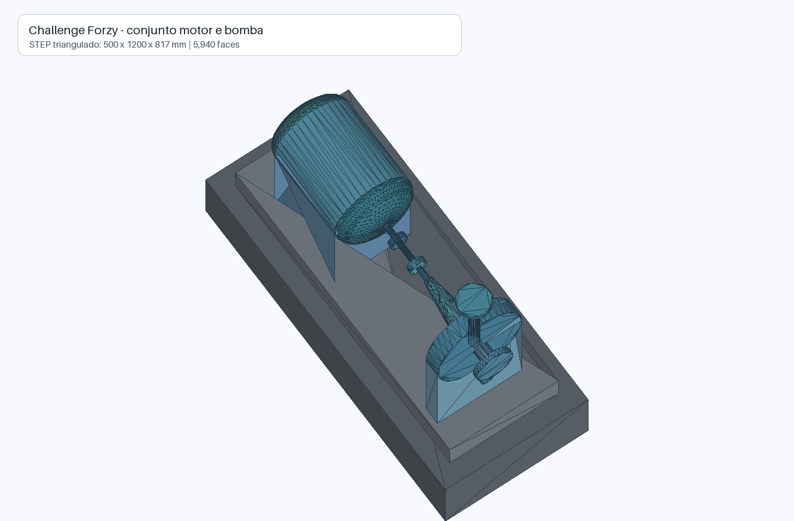

# Jornada técnica do Forzy TwinOps

Este diretório registra como o Forzy TwinOps evolui de um protótipo com dados
sintéticos para um demonstrador preditivo baseado em medições reais.

O registro tem dois objetivos:

- orientar decisões técnicas com evidências;
- produzir insumos verificáveis para o storytelling do pitch.

## Regra editorial

Cada afirmação relevante deve usar uma destas categorias:

- **Evidência:** observação reproduzível em dados, código ou teste.
- **Hipótese:** explicação ou resultado que ainda precisa de experimento.
- **Decisão:** escolha arquitetural aprovada e sua justificativa.
- **Resultado:** conclusão obtida após executar um experimento definido.
- **Limitação:** condição que restringe a validade do resultado.

O pitch não deve apresentar uma hipótese como resultado nem uma anomalia como
falha mecânica confirmada.

## Objetivo atual

Construir um demonstrador pré-operacional que:

1. colete medições reais dos sensores S1 e S2;
2. preserve e normalize o histórico recebido em planilha;
3. identifique deterioração nos sinais de vibração e temperatura com regras e
   ML clássico de baixa latência;
4. produza alertas antecipados com evidências rastreáveis;
5. use um SLM ou LLM para explicar o alerta e assistir o técnico;
6. meça o que falta para evoluir até um sistema industrial confiável.

## Decisões atuais

### DEC-001: trocar o mock por um pipeline curado

**Decisão:** usar o CSV bruto como entrada imutável, executar validação e
normalização, e expor um contrato de dados estável para o TwinOps.

**Justificativa:** o app não deve misturar limpeza de dados, inferência e
renderização. Um contrato estável também permite trocar arquivos por uma API
sem reescrever os componentes.

### DEC-002: combinar histórico e leitura ao vivo

**Decisão:** manter o CSV curado como fonte histórica e usar os endpoints S1 e
S2 como fonte da leitura mais recente.

**Justificativa:** os endpoints entregam somente o último valor. Sem coleta e
persistência próprias, eles não formam a série temporal necessária para ML.

### DEC-003: separar detecção e explicação

**Decisão:** executar ML clássico no caminho crítico do alerta e manter o
SLM/LLM fora desse caminho.

**Justificativa:** a previsão precisa ser rápida, determinística e disponível
mesmo quando o modelo de linguagem ou a internet falharem. O SLM/LLM recebe o
resultado estruturado para explicar evidências, consultar documentos e ajudar
o técnico.

### DEC-004: comparar Qwen local com uma API

**Decisão:** usar Qwen3-4B `Q4_K_M` como primeiro candidato local, uma API de
LLM como referência de qualidade e fallback, e adiar o fine-tuning.

**Justificativa:** o checkpoint GGUF ocupa cerca de 2,5 GB e cabe com margem na
RTX 3060 Ti de 8 GB. O fine-tuning só terá um objetivo verificável depois que
existirem casos de teste e falhas recorrentes do modelo base.

## Evidências disponíveis

### Backtest reproduzível no CSV real

- As 7.183 linhas foram normalizadas em 14.366 leituras canônicas, uma por
  sensor, preservando o registro bruto e a procedência.
- O intervalo observado foi de 11:46:10 a 15:43:14 em 19 de maio de 2026. Como
  o CSV não declara timezone, `America/Sao_Paulo` está registrado como hipótese
  de importação, não como fato medido.
- A segmentação por gaps de 15 segundos produziu 204 ciclos. A curadoria
  separou 8.562 repetições consecutivas, preservou 5.804 novas informações e
  produziu 5.066 linhas com features válidas.
- O walk-forward cronológico executou 200 folds e manteve os dois ciclos finais
  como holdout congelado.
- A latência local do scoring em lote de cada fold ficou em 4,69 ms no p50,
  7,47 ms no p95 e 126,78 ms no p99.
- O ranking gerou eventos candidatos, mas o conjunto não contém rótulos de
  falha. Score significa distância do baseline histórico, não probabilidade de
  falha.

**Resultado:** os dados são suficientes para demonstrar ingestão real,
reprodutibilidade e inferência rápida. Não são suficientes para estimar
confiabilidade preditiva, taxa de falso alerta ou antecedência de falha.

### EDA da planilha real

- 7.183 registros em aproximadamente 3 horas e 57 minutos.
- Seis ativações e cerca de 28,9 minutos de operação.
- Eventos candidatos às 13:48:10 e 13:56:10, com mudança em degraus no canal
  chamado `Velocidade` durante um ciclo sustentado.
- Temperaturas máximas de 46 e 47, registradas após a parada.
- 297 intervalos maiores que 10 segundos, intervalo máximo de 228,4 segundos,
  e sete timestamps duplicados.

**Correção de interpretação:** a ficha do sensor mostra que `Velocidade`
representa velocidade de vibração RMS em `mm/s`, não velocidade de rotação do
eixo. A interpretação inicial como possível mudança de carga ou setpoint não
pode ser mantida sem uma nova análise.

**Limitação:** faltam setpoint, RPM, corrente, torque, carga, alarmes e espectro
de vibração. O conjunto não confirma uma causa mecânica.

Origem: conversa `EDA Motor Forzy Promon`, identificador
`6a79bbae-2644-83e9-af9b-df4690c9ea88`.

### Verificação da API em 12 de agosto de 2026

- Os endpoints [S1](https://reseller-prescribed-facing-dept.trycloudflare.com/get_s1)
  e [S2](https://reseller-prescribed-facing-dept.trycloudflare.com/get_s2)
  responderam com HTTP 200 e `application/json`.
- A latência observada ficou entre aproximadamente 76 e 507 ms.
- O payload contém velocidade, aceleração e temperatura.
- O payload não contém timestamp, unidade, sequência, qualidade ou
  identificação completa do ativo.
- As respostas não habilitam CORS. O front-end não deve chamar os endpoints
  diretamente.
- A API respondeu antes das 12h. A janela informada parece controlar a
  atualização, não necessariamente a disponibilidade.

**Limitação:** um endereço `trycloudflare.com` é temporário e não oferece SLA.
A própria [documentação de Quick Tunnels](https://developers.cloudflare.com/cloudflare-one/networks/connectors/cloudflare-tunnel/do-more-with-tunnels/trycloudflare/)
restringe esse mecanismo a testes e desenvolvimento.

### Especificação do sensor de vibração

O material fornecido identifica o sensor como Pepperl+Fuchs
`VIM32PL-E1AC8-0RE-IO-1V1401`, com tecnologia MEMS capacitiva e interface
IO-Link 1.1.

- Velocidade de vibração RMS: faixa de 0 a 128 `mm/s`.
- Aceleração de vibração RMS: faixa de 0 a 10 `g`.
- Temperatura: faixa de -40 a 85 °C.
- Frequência medida: 10 a 1.000 Hz.
- Taxa interna de amostragem: 8 kHz.
- Tempo de média RMS: 2 segundos para velocidade e aceleração.
- Resolução: 0,01 `mm/s` e 0,01 `g`.
- Exatidão declarada: ±0,1 `mm/s` e ±0,01 `g` nas condições de calibração.
- Dados IO-Link disponíveis: velocidade RMS, aceleração de pico, aceleração
  RMS, temperatura e status.
- Ciclo mínimo do IO-Link: 5 ms em COM2, 38,4 kbit/s.

**Implicação:** os 8 kHz descrevem a aquisição interna do MEMS. O valor RMS
entregue ao sistema já agrega uma janela de 2 segundos. Consultar a API muitas
vezes dentro dessa janela não cria medições independentes. Para o demonstrador,
a prioridade é comprovar o timestamp e a cadência de atualização na API.

**Limitação:** o nome `Aceleração` no endpoint não informa se o valor representa
aceleração RMS ou de pico, embora o sensor possa fornecer ambos.

### Modelo CAD do conjunto

O arquivo STEP contém 17 sólidos trianguláveis do conjunto motor, bomba e base.
O envelope geométrico aproximado é de 500 x 1.200 x 817 mm.

Os nomes das peças distinguem grupos do motor (`ME22A`), bomba (`BOMBA`) e
base. O arquivo não identifica explicitamente o sensor VIM32 nem um componente
com as dimensões de 23,8 x 72,5 mm da ficha técnica.

**Limitação:** o CAD confirma a geometria geral, mas não comprova o ponto, o
eixo ou o método de montagem dos sensores S1 e S2. Essas informações afetam a
comparação entre os canais e a interpretação da vibração.

## Questões em aberto

- Qual é a frequência real de atualização dos sensores?
- O endpoint `Aceleração` entrega valor RMS ou valor de pico?
- A Forzy pode incluir timestamp, sequência e qualidade no payload?
- Onde S1 e S2 estão montados e em quais eixos eles medem?
- Qual evento operacional será usado como rótulo de falha ou intervenção?
- Qual antecedência mínima torna um alerta útil para a equipe de manutenção?
- Qual taxa de falso alerta é aceitável no demonstrador?

## Documentos relacionados

- [Registro de experimentos](experimentos.md)
- [Storytelling do pitch](storytelling-pitch.md)
