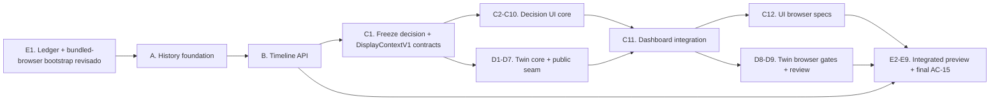

# Unified History and Interactive Twin Execution Index

> **For agentic workers:** REQUIRED SUB-SKILL: Use `superpowers:subagent-driven-development` (recommended) or `superpowers:executing-plans` to implement this plan task-by-task. Every task uses checkbox (`- [ ]`) syntax and must be closed with fresh verification on its resulting SHA.

**Goal:** Coordenar a evolução do TwinOps para uma linha do tempo unificada de dados reais, uma interface orientada à decisão e um twin 3D investigável, preservando causalidade, proveniência e gates operacionais separados.

**Architecture:** Cinco planos isolam persistência/importação, contratos e API temporal, experiência frontend, 3D e prova integrada. Histórico e live continuam armazenados separadamente e são unidos somente por uma projeção de leitura. Um único `displayContext` confirmado alimenta decisão, cartões, timeline, avaliação e 3D.

**Tech Stack:** React 18, Vite 5, Recharts 2, Three.js 0.169, React Three Fiber 8, Drei 9, JavaScript, Python 3.12, FastAPI, Pydantic 2, SQLite, PostgreSQL/Neon, pytest, Vitest, Playwright e Vercel.

**Spec:** `docs/superpowers/specs/2026-08-22-unified-history-interactive-twin-design.md`

## Global Constraints

- Base congelada de planejamento: `4d1cc82fce1b147a3e50315fafdcd37d90dc9a7e`.
- Spec aprovada congelada por SHA-256: `20629d860f19a212bc2b941d6270e2316c747a0b85c473f0b51bbee6106e3a44`; qualquer mudança exige nova aprovação/revisão antes da execução.
- Este índice substitui especificamente a proibição histórica de importar/exibir o CSV presente em `2026-08-13-real-twinops-execution-index.md`; as demais garantias de ativo único, origem real e honestidade semântica permanecem.
- Identidade do ativo: `forzy-motor-01`; `officialTag` permanece `null` até evidência da Forzy.
- O CSV Forzy só entra por importador offline explícito, hash fixado e perfil `forzy-history-2026-05-19-v1`; nunca entra no bundle, em rota pública ou em commit.
- Tabelas históricas e live permanecem separadas. A timeline é projeção de leitura, não regravação de origem.
- Nenhuma lacuna é interpolada; ausência não vira zero, carry-forward, parada, normalidade ou falha.
- Avaliação histórica só usa resultados walk-forward causais com `trainingEnd < windowStart` e `windowEnd <= anchor.eventAt`.
- `assessment.recommendation` livre não aparece na UI operacional nem no pacote de evidências.
- Condição, escopo temporal, coleta, disponibilidade, frescura e confiança são dimensões independentes.
- O 3D consome o `displayContext`; nunca calcula status, causalidade ou localização de sensor.
- GLB, manifesto e relatório de conversão atuais ficam imutáveis. A Fase D regenera e versiona somente o PNG de fallback a partir da nova composição, preservando a mesma proveniência do STEP; PBR é tratamento visual ilustrativo, não material físico confirmado.
- S1/S2 não recebem âncora física no CAD. Toda superfície deve declarar `Posição física não validada`.
- Acesso à configuração protegida do preview, migração de banco, importação no preview, materialização causal, ativação, deploy preview e uso de bypass de automação no navegador são autorizações distintas. Este índice não concede nenhuma delas.
- Nenhum plano pode executar POST de refresh, acessar o upstream Forzy, ler segredos ou promover produção sem autorização específica no momento do gate.
- Em Windows PowerShell 5.1, todo processo nativo é verificado imediatamente por exit code antes da próxima instrução; commits exigem staged scope/diff e HEAD novo comprovados. Um comando posterior bem-sucedido nunca pode mascarar uma falha anterior.
- `docs/verification/unified-twin-acceptance-v1.json` é o único ledger cumulativo rastreado; contém subledgers A–E, critérios AC-01..AC-28 e todos os findings. O Markdown homônimo é regenerado e byte-verificado após **cada** mutação do JSON. Cada plano usa `ingest-review` para registrar `verifiedCodeCommit`/verdict e `update-criterion` para sua evidência permitida; somente E pode usar `ingest-evidence-review`, que preserva o SHA/verdict de código e acumula findings de um commit de evidência já existente. Suíte verde isolada não encerra finding. O commit de evidência é derivado pelo Git após existir e nunca é autorreferenciado dentro do próprio ledger; o PASS final desse commit é entregue externamente e não se autoingere.

## Baseline verificado em 2026-08-22

- Git: branch `luis/real-twinops-integration`, SHA `4d1cc82fce1b147a3e50315fafdcd37d90dc9a7e`, worktree rastreado limpo antes dos planos.
- Python isolado no worktree: `655 passed, 7 skipped, 2 warnings` em `55.37s` com `PYTHONPATH` apontando para `services/twinops/src` do worktree. Os warnings são Starlette/httpx e detecção de cores físicos do joblib já conhecidos.
- Frontend: `160 passed, 1 skipped` em 16 arquivos usando `npm.cmd run test:run -- --exclude "**/.pytest_cache/**"`.
- O `.pytest_cache` compartilhado possui ACL local restritiva; ele é ruído ambiental e deve ser excluído apenas da coleta Vitest, nunca removido por um worker.
- O ambiente virtual compartilhado aponta por editable install para o checkout principal. Comandos Python executados da raiz do worktree devem definir `PYTHONPATH=$PWD\services\twinops\src;$PWD` antes do pytest.
- A Vercel CLI não está instalada nesta sessão. Recomenda-se fortemente instalar a CLI com `npm i -g vercel`; para executar esta suíte de forma reproduzível, somente com autorização, usar o pin `npm i -g vercel@59.3.0` e bloquear qualquer mudança de versão, identidade, team ou projeto.

## Planos e dependências

| Ordem | Plano | Entrega | Depende de | Pode avançar em paralelo |
| --- | --- | --- | --- | --- |
| A | `2026-08-22-forzy-history-foundation-plan.md` | contratos históricos, migration 003, repositórios, CLI stage/activate e prova byte-exact | E1 revisado e entregue | D após o checkpoint C1 |
| B | `2026-08-22-operational-timeline-api-plan.md` | schemas Timeline/Decision, projeção archive+live, gaps, downsampling, contexto e avaliações causais | A para persistência; contratos iniciais podem começar antes | D |
| C | `2026-08-22-decision-oriented-timeline-ui-plan.md` | provider `now/historical`, regras decisórias, timeline, candidatos, tabela e dashboard | schemas/fatos de B; Task C1 congela `OperationalDecisionViewV1` e o shape/validator de `DisplayContextV1`; C11 espera D7 | C2–C10 com D1–D7 |
| D | `2026-08-22-interactive-engineering-twin-plan.md` | PBR por grupo, seleção, foco, inspector lógico S1/S2 e fallback sincronizado | E1 fornece config Chromium; C1 fornece `DisplayContextV1`; D8 espera C11 | A, B e C2–C10 |
| E | `2026-08-22-unified-twin-preview-validation-plan.md` | bootstrap revisado do ledger/Chromium; depois preflight integrado, operações autorizadas retomáveis, build auditado, preview protegido, E2E e evidência | Task E1 revisada antes de A; Tasks E2–E9 após A+B+C+D revisados | nenhuma |



Somente E1 é antecipada e precisa receber review independente antes do handoff para A. Depois de C1, C2–C10 e D1–D7 podem avançar em paralelo; a ordem obrigatória de integração visual é `D7 → C11 → D8`. As Tasks E2–E9 permanecem bloqueadas até A+B+C+D integrados e revisados. C autoria o cenário AC-15, mas somente E9 o executa e fecha no `verifiedCodeCommit` integrado exato.

## Ownership sem colisões

| Plano | Ownership principal | Arquivos serializados |
| --- | --- | --- |
| A | `twinops/ingestion/history*_v1.py`, `twinops/storage/*historical*_v1.py`, `twinops/history_admin.py`, migration 003, contratos históricos e seus testes | `v2_repository.py`, `sqlite_v2_repository.py`, `postgres_repository.py`, `check_postgres.py` |
| B | contratos Timeline/Decision, `services/twinops/src/twinops/timeline/**`, rotas/contexto/snapshot, testes de API | `v2_routes.py`, `v2_snapshot.py`, repositórios compartilhados com A |
| C | contratos JS, decision support, reducer/provider, data source, componentes operations/timeline, CSS e E2E frontend | `TwinOpsContext.jsx`, `OperationsDashboard.jsx`, `src/styles.css` |
| D | `src/components/Twin3D.jsx`, `src/components/twin3d/**`, seus testes e somente `public/models/conjunto-motor-bomba-preview.png` | `OperationsDashboard.jsx` somente pelo integrador C/E; GLB/manifest/conversion-report protegidos |
| E | ledger, `playwright.twin.config.js`, `vercel.json`, scripts de verificação/E2E, docs de deploy/usabilidade, integração final e relatório | qualquer conflito de `OperationsDashboard.jsx`, `App.jsx`, E2E e packaging |

Regras de serialização:

1. A integra primeiro as extensões de repositório; B rebasa/integra sobre esse SHA antes de editar os mesmos protocolos.
2. E1 primeiro congela, testa e recebe review independente da configuração frontend-only do Chromium bundled. A Task C1 congela, exporta e recebe review do shape/validator de `DisplayContextV1` e do contrato `OperationalDecisionViewV1`; somente depois desse checkpoint D consome nominalmente o mesmo validator e as mesmas fixtures completas. Os adaptadores `now/historical` chegam na Task C5. D1–D7 e C2–C10 podem avançar em paralelo, mas a integração pública segue a ordem `D7 → C11 → D8`; C11 também recebe review/handoff próprio antes de D8.
3. Só E conecta C e D em `OperationsDashboard.jsx` se ambos ainda não tiverem sido integrados pelo mesmo worker.
4. `vercel.json` é alterado somente em E, depois que os paths finais da migration e módulos Python estiverem estáveis.
5. Executar Task E1 como bootstrap antes de A; depois cada Fase A–E atualiza somente seu subledger JSON pelo comando versionado e regenera/verifica o Markdown após toda mutação.

## Cobertura da especificação

| Seções da spec | Responsável primário | Evidência de fechamento |
| --- | --- | --- |
| 1–6 — decisão, valor, evidência, objetivos, escopo e arquitetura | índice + C | contratos congelados e hierarchy testada |
| 7 — persistência/importação | A | migration, byte reconstruction, stage/activate e repositórios |
| 8 — contrato da timeline | B | schemas triplos, cursor, gaps, downsampling e rotas |
| 9 — avaliação histórica/decisão | B + C | causal exporter + ruleset determinístico e matriz completa |
| 10–11 — estado e experiência frontend | C | reducer/provider, timeline, tabela, candidatos e E2E |
| 12–13 — 3D e fidelidade | D | cena, seleção, inspector e gates de evidência |
| 14 — performance/acessibilidade | C + D + E | unitários, Playwright, rAF e viewport móvel |
| 15–16 — falhas, segurança, proveniência e custo | A+B+E | fail-closed, fingerprints, bundle e probes sanitizados |
| 17 — estratégia de testes | todos | RED/GREEN por task e suíte final |
| 18 — 28 critérios de aceite | E | ledger AC-01..AC-28 |
| 19–21 — fases, gates e decisões congeladas | índice + E | dependências e checkpoints externos |

## Estratégia de branches e commits

- Criar worktrees por plano a partir do SHA de dependência indicado, com prefixo `luis/`.
- Cada Task produz um commit pequeno com testes RED registrados antes do GREEN.
- Nenhum worker faz merge, push, migração remota, importação remota ou deploy por inferência.
- Antes de aplicar commits, o integrador executa `git diff --check` e confirma que o parent esperado é ancestral.
- Após integrar cada plano, executar a matriz mínima abaixo no SHA integrado.

```powershell
function Assert-NativeSuccess([string]$label) {
  if ($LASTEXITCODE -ne 0) { throw "$label failed with exit code $LASTEXITCODE" }
}
$env:PYTHONPATH="$PWD\services\twinops\src;$PWD"
& "..\..\services\twinops\.venv\Scripts\python.exe" -m pytest services/twinops/tests -q
Assert-NativeSuccess 'integrated Python suite'
npm.cmd run test:run -- --exclude "**/.pytest_cache/**"
Assert-NativeSuccess 'integrated frontend suite'
npm.cmd run build
Assert-NativeSuccess 'integrated frontend build'
git diff --check
Assert-NativeSuccess 'integrated diff hygiene'
```

## Gate 0 — congelar contratos compartilhados

- [ ] Confirmar que A/B definem os mesmos enums e nomes em JSON Schema e Pydantic.
- [ ] Confirmar que A/B definem o mesmo `TimelineDecisionFactsV1`; B não produz copy nem `OperationalDecisionViewV1`.
- [ ] Confirmar que C1 congela `OperationalDecisionViewV1` e que C1/D usam o mesmo `DisplayContextV1`, incluindo exatamente `viewMode: "now" | "historical"`.
- [ ] Confirmar que C1 foi revisado no SHA exato, que D importa o validator/fixtures completos desse handoff e que o hash decisório usa o `DisplayContextV1` canônico inteiro.
- [ ] Confirmar que `DisplayContextV1` fecha recursivamente todos os subobjetos/arrays, rejeita extras, segredos, ciclos e valores não JSON/finitos e que hash/export usam somente clone canônico deep-frozen.
- [ ] Executar fixtures cruzadas JSON Schema/Pydantic/JS e registrar o hash canônico dos rulesets.
- [ ] Re-review independente: zero Critical/Important antes de iniciar UI sobre shapes novos.

## Gate A — fundação histórica local

- [ ] Migration 003 passa em SQLite novo, SQLite já migrado e PostgreSQL de teste opt-in.
- [ ] Importador reproduz bytes, 7.183 raw rows, 14.366 samples, 204 operating cycles e todos os hashes.
- [ ] Reimportar o mesmo lote é no-op atestado; lote divergente falha fechado.
- [ ] Ativação concorrente mantém exatamente um lote ativo por asset e preserva o anterior em qualquer erro.
- [ ] Dry-run local não escreve; relatório não contém path absoluto, DSN, bytes brutos ou segredo.
- [ ] Em gate local separado e autorizado, um SQLite novo/ignorado recebe o CSV real staged, reconstrói hashes/contagens e prova segundo stage no-op; o arquivo nunca é ativado, rastreado ou entregue a outro worker fora do handoff do controller.
- [ ] Nenhum CSV/row/blob aparece no Git ou bundle.

## Gate B — timeline causal

- [ ] Timeline une somente lote `active` e live sem deduplicar entre origens.
- [ ] Ordem, cursor, `[from,to)`, limites e erros 409/422 obedecem ao contrato.
- [ ] Gaps são reprodutíveis pela política persistida; `expected_idle` não vira falha de cobertura.
- [ ] `time_bucket_envelope_v1` preserva primeiro/min/max/último e respeita `maxPoints`.
- [ ] Contexto `at-or-before` consulta pontos originais e nunca cruza gap.
- [ ] Assessment histórico satisfaz as duas desigualdades causais; pontos precoces retornam `null`.
- [ ] B exporta e recebe review independente do manifesto causal local sanitizado, ligado ao SHA de código, aos três hashes pinados, ao lote, às contagens e aos invariantes de âncora/episódio.
- [ ] O manifesto causal entra no `phaseBEvidenceCommit` externo de escopo exato; E verifica ancestry, blobs e SHA do manifesto sem fingir que ele existe no commit de código revisado de B.
- [ ] C autentica o handoff B→C por code/evidence commits, ledger PASS, ancestry, escopo e hashes dos contratos/fixtures antes de C3/C5 e revalida os mesmos bindings no review final.
- [ ] `snapshot.history` fica limitado a 50 frames por sensor sem reduzir a janela interna do scorer.

## Gate C — decisão e histórico no frontend

- [ ] Uma seleção só muda o `displayContext` após resposta de contexto validada.
- [ ] Refresh live em background não move cursor histórico; `Voltar para agora` é explícito.
- [ ] Matriz decisória cobre todas as combinações válidas sem sobreposição; combinação ausente falha fechada.
- [ ] Casos B são contextos completos 1:1, não facts sobrepostos a uma fixture default; disponibilidade, par de canais, assessment, âncora, episódio, origem e capabilities satisfazem invariantes cruzadas.
- [ ] `assessment.recommendation`, score cru e textos proibidos não chegam à decisão/export.
- [ ] Timeline mostra proveniência e gaps sem linha conectada; tabela pagina pontos originais.
- [ ] Primeira dobra em 1366×768 mostra situação, confiança, última observação, persistência, evidência dominante e próximo check; estados ausentes são explícitos. C autoria o teste e E9 o executa/fecha como AC-15 no SHA integrado exato.
- [ ] Fluxo é operável por teclado e possui tabela equivalente ao gráfico.
- [ ] Os checkpoints C1 e C11 possuem reviews/handoffs independentes no SHA exato, mantêm o subledger C `in_progress` e não antecipam o fechamento do AC-15.
- [ ] O fechamento C gera `docs/verification/phase-c-gate-manifest.json` no contrato `phase-c-gate-manifest-v1`, ligado ao `verifiedCodeCommit`, e só o considera elegível quando as suítes Vitest completas, build, discovery Playwright, ownership scan e autenticação B→C estão registradas como aprovadas e são revalidadas pelo helper C-owned.
- [ ] O fechamento C preserva externamente `PHASE_C_EVIDENCE_COMMIT`, autentica novamente os handoffs B→C/C1/C11 e exige diff de evidência exatamente igual a `phase-c-findings.json`, `phase-c-gate-manifest.json`, ledger JSON e Markdown gerado. E lê os quatro blobs diretamente desse commit e repara seus hashes/bindings; o ledger não tenta autorreferenciar o próprio commit de evidência.

## Gate D — twin investigável

- [ ] Motor, bomba, acoplamento e base são resolvidos apenas por nomes exatos do manifesto.
- [ ] Aparência por grupo, arestas, luz e seleção não alteram GLB/manifest/conversion-report nem fazem claims de materiais reais; o novo PNG possui hash/proveniência regenerados e revisados.
- [ ] Cursor histórico muda dados/status do inspector sem remontar canvas, recarregar GLB ou resetar câmera.
- [ ] Selecionar S1/S2 nunca cria marcador/posição física.
- [ ] Gap produz estado neutro e ausência explícita, nunca interpolação.
- [ ] WebGL/chunk/manifest/GLB falhos preservam preview, timestamp, origem e inspector lógico.
- [ ] Reduced motion mantém interação sem animação/inércia.
- [ ] D1/D8 leem os handoffs/reports C1/C11 diretamente dos evidence commits e comprovam ancestry, escopo exato, digest, verdict e bindings; variáveis de ambiente isoladas não autenticam um checkpoint.
- [ ] Ownership D é auditado em dois intervalos disjuntos — `phaseDStartCommit..d7PublicSeamCommit` e `phaseD8StartCommit..verifiedCodeCommit`; o intervalo C11 autenticado entre eles nunca é atribuído ao código D.
- [ ] O evidence commit D muda exatamente sete artefatos, é filho direto do `verifiedCodeCommit` e é reparsado por blobs Git; verdict, digest, quatro checkpoints e critérios do ledger precisam coincidir com `0 Critical / 0 Important / 0 Minor`.

## Gate E — prova integrada e operações externas

- [ ] E1 instala/prova o Chromium bundled quando autorizado, fecha o bootstrap frontend-only e recebe review independente antes de A.
- [ ] O probe E1 vincula package, `playwright-core/browsers.json`, `chromiumRevision`, executable hash e lançamento real; navegador do sistema ou revision implícita não contam.
- [ ] E2 executa preflight fail-closed sobre spec, índice, ledger, SHAs/findings/handoffs A–D, ancestry, sequência `D7 → C11 → D8` e allowlist de arquivos tracked, ignored e untracked antes de qualquer operação externa.
- [ ] E2 lê os blobs Git e prova allowlists exatas de cada transição código→evidência de E1, A, B, C e D; ancestry ou um report com `reviewedSha` correto não autorizam arquivos executáveis extras.
- [ ] Re-review dos quatro planos anteriores no SHA integrado: 0 Critical/0 Important.
- [ ] Build local inclui migration 003 e módulos novos; exclui CSV, bytes históricos, env, testes e artefatos não autorizados.
- [ ] Jornada SQLite end-to-end importa, ativa, consulta, navega e renderiza sem rede.
- [ ] Cada retomada após autorização parte de checkpoint sanitizado/versionado, revalida nonce, frescor, exit code, Git, executáveis e identidade remota e não depende de estado PowerShell anterior.
- [ ] Cada commit E começa com índice vazio, recebe somente a allowlist declarada, passa `git diff --cached --check` e comprova parent direto e novo HEAD; nenhum arquivo previamente staged pode entrar silenciosamente.
- [ ] Solicitar autorização explícita antes de ler/usar configuração protegida do preview; valores, DSN e credenciais permanecem somente em memória e nunca entram em logs/evidências.
- [ ] Antes dessa autorização, E audita somente instalação/path/hash/version/help/link local da CLI; `whoami --format json` e `project inspect --non-interactive --scope` entram apenas no `initialize` autorizado e falham fechado em login/SAML/team divergente.
- [ ] Solicitar autorização explícita antes de migration no banco preview.
- [ ] Solicitar autorização explícita separada antes de importar o CSV no preview.
- [ ] Assessment dry-run, apply e revalidation no preview coincidem campo a campo com o manifesto causal local revisado vindo do `phaseBEvidenceCommit` antes de qualquer ativação.
- [ ] Solicitar autorização explícita separada, após o lote existir e o dry-run passar, antes de materializar avaliações causais.
- [ ] Solicitar autorização explícita separada para ativar o lote por compare-and-swap.
- [ ] Solicitar autorização explícita antes de criar novo deployment preview.
- [ ] Antes do build, commit limpo define `verifiedCodeCommit`; imediatamente antes de `--prebuilt`, output, digest, CLI, link, project e team são reatestados. O deployment fica ligado a esse SHA/output; evidência posterior recebe SHA próprio e nunca substitui a identidade do código implantado.
- [ ] Recuperação após crash consulta em JSON todos os deployments pelos três metadados do intent: exatamente um pode ser inspecionado/reutilizado; zero exige nova autorização e múltiplos bloqueiam sem redeploy automático.
- [ ] Smoke preview protegido usa `vercel curl` e somente GET; POST refresh permanece em gate próprio.
- [ ] O `curl.exe` efetivamente usado por `vercel curl` tem path canônico e SHA-256 congelados no checkpoint, é reatestado antes de cada probe e um executável falso anterior no `PATH` precisa ser rejeitado.
- [ ] Playwright protegido só usa `VERCEL_AUTOMATION_BYPASS_SECRET` após autorização própria, exclusivamente em memória; Deployment Protection nunca é desabilitada e nenhum valor/cookie entra em log ou commit.
- [ ] Estado/método/escopo/exceptions de Deployment Protection são lidos como contrato tipado e reatestados antes de deploy, smoke, browser e fechamento; a URL do preview não pode estar exceptuada.
- [ ] O header de bypass nunca é global: somente origem, métodos e paths exatos do deployment podem recebê-lo; toda origem externa é bloqueada e o teste comprova zero vazamento cross-origin.
- [ ] Findings da revisão operacional E1–E5 são ligados por digest/linhagem ao review final e ao ledger; nenhum ID pode desaparecer entre os dois reports.
- [ ] Logs cobrem `error`, `warning` e `fatal` com `--no-branch` e intervalo `--since/--until` ligado ao deployment; são reconsultados após o último acesso remoto de E8/E9 e o resumo sanitizado final substitui a evidência anterior.
- [ ] Playwright prova now, histórico, gap, fallback 3D, teclado e mobile.
- [ ] AC-15 é executado novamente no `verifiedCodeCommit` exato de E e só então atualizado no subledger E; ancestry ou resultado de um SHA anterior não bastam.
- [ ] Protocolo humano registra os dois perfis técnicos; automação não o marca como concluído.
- [ ] Os quatro cenários humanos usam harness facilitado browser-only, revisado e vinculado a code/output/deployment/fixture digests; nunca injetam mock no runtime. Resultado `failed|blocked` também é validado, renderizado e commitado antes da parada.
- [ ] Produção permanece bloqueada; se vier a ser proposta, exige cinco autorizações novas e independentes — migration, stage/importação, materialização de assessments, ativação e deploy/promoção de produção. Nenhuma autorização preview é reaproveitada.
- [ ] O fechamento usa verificação `require-complete`: planos A–E aprovados, AC-01..AC-28 exatamente uma vez e todos `passed`, vínculos de SHA/evidência válidos, zero Critical/Important aberto e nenhum Minor sem `fixed|accepted` documentado.

## Rollback por camada

- **Código:** voltar ao deployment/SHA anterior; nunca apagar tabelas por rollback de app.
- **Migration 003:** aditiva e idempotente; não há downgrade destrutivo automático.
- **Lote:** ativar outro lote completo por compare-and-swap autorizado; não deletar lote/bytes para “desfazer”.
- **Preview:** após nova autorização de deploy preview, criar uma nova preview a partir do SHA/output anterior auditado e repetir smoke GET. `vercel promote` é proibido neste fluxo porque altera produção.
- **3D:** fallback estático permanece funcional porque os assets atuais não mudam.
- **Produção:** fora do escopo desta suíte até autorização explícita posterior.

## Definition of Done da suíte

- [ ] Os cinco planos estão implementados e os subledgers A–E do JSON cumulativo estão fechados sem descartar findings históricos.
- [ ] Cada plano recebeu re-review independente no SHA exato entregue.
- [ ] Os 28 critérios de aceite da spec possuem evidência automatizada ou gate humano explicitamente pendente.
- [ ] Nenhum gate humano/externo foi convertido em teste “verde” por simulação.
- [ ] Relatório final liga SHA, migration, lote, rulesets, deployment preview, screenshots, probes e limitações sem expor segredo.
- [ ] O usuário recebe uma decisão separada sobre produção; esta suíte não promove automaticamente.
