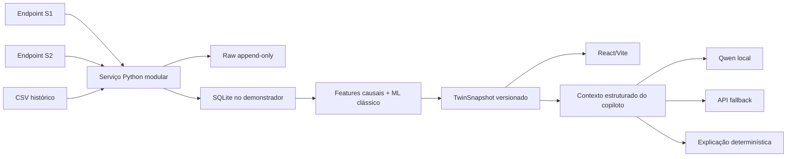

# TDD — Forzy TwinOps: demonstrador preditivo com dados reais

| Campo | Valor |
| --- | --- |
| Responsável de produto | Luis |
| Responsável técnico | Coordenação Forzy TwinOps |
| Repositório-alvo | `9luis7/forzy-twinops` |
| Branch-base | `main` |
| SHA-base verificado | `1f21f264f88d7a64fecc37e3b3e620eb46d35587` |
| Status | Aprovado para decomposição e planejamento paralelo |
| Criado em | 2026-08-12 |

## 1. Contexto

O Forzy TwinOps é um protótipo React/Vite sem backend. O estado global atual é
produzido por um loop determinístico em `LiveTwinContext.jsx`,
`useLiveTelemetry.js` e `src/data/mock.js`. Gauges, gráfico, alertas, twin SVG e
copiloto consomem a mesma simulação.

A próxima versão deve preservar essa coerência visual, mas acrescentar uma
trilha real: importar o CSV histórico, coletar os snapshots S1 e S2, formar um
histórico auditável, calcular scores de anomalia e deterioração e explicar as
evidências sem colocar o LLM no caminho crítico.

Os endpoints atuais entregam apenas o valor mais recente, sem timestamp de
aquisição, unidade, sequência ou qualidade. Eles não têm CORS e usam um hostname
temporário. A ficha do sensor sustenta que `Velocidade` é velocidade de vibração
RMS, não RPM. A semântica de `Aceleração` permanece não confirmada.

## 2. Problema e motivação

- O mock prova o fluxo do produto, mas não prova integração ou detecção sobre
  dados reais.
- As 7.183 linhas históricas representam cerca de seis acionamentos e são
  autocorrelacionadas; um split aleatório criaria vazamento temporal.
- A API não mantém histórico. Cada leitura não coletada durante a atualização é
  perdida.
- O frontend atual mistura unidade, detecção e apresentação. Isso permite que
  dados reais sejam exibidos com semântica errada.

O demonstrador precisa provar o pipeline e explicitar suas limitações. Não deve
afirmar previsão de falha específica, causa raiz ou vida útil restante sem
rótulos confirmados.

## 3. Objetivos

1. Preservar dados brutos e produzir telemetria canônica, versionada e
   auditável.
2. Manter replay determinístico e habilitar leitura real por configuração.
3. Produzir `anomaly_score` e `deterioration_score` com baixa latência e
   evidências rastreáveis.
4. Exibir o conjunto CAD real sem inventar a posição dos sensores.
5. Oferecer explicação assistida por SLM/LLM com fallback determinístico.
6. Produzir evidências e limitações úteis para o pitch.

## 4. Fora do escopo desta versão

- Classificar uma falha mecânica específica como verdade confirmada.
- Estimar RUL ou horário de falha.
- Fine-tuning de SLM/LLM.
- Aprendizado online automático.
- Kafka, Redis, Kubernetes, banco time-series ou microsserviços por domínio.
- Autenticação corporativa, operação multi-planta ou SLA industrial.
- Simulação física/FEA derivada do STEP.
- Afirmar localização/eixo de S1 e S2 antes da confirmação da Forzy.

## 5. Arquitetura aprovada

### Escolhas de simplicidade

- Um único serviço Python modular abriga API, coleta, persistência e inferência.
  Python reduz a distância entre o pipeline de dados e scikit-learn sem criar
  vários serviços operacionais.
- SQLite é o storage inicial; a interface de repositório não depende dele.
  Postgres é uma evolução de deploy, não pré-requisito para provar a solução.
- Polling inicial: 5 segundos, configurável. A média RMS interna é de 2 segundos,
  mas a cadência real do endpoint ainda é desconhecida. Duplicatas são
  preservadas no raw e sinalizadas na camada curada.
- A coleta é um processo contínuo durante a janela configurada. Funções
  serverless não serão usadas como scheduler de polling subminuto.
- O frontend nunca chama `trycloudflare.com`, Qwen ou provedor de LLM
  diretamente.

## 6. Contratos e fonte única de verdade

O contrato normativo está em
[`work-packages/00-contratos-e-integracao.md`](work-packages/00-contratos-e-integracao.md).

O backend produz `TwinSnapshot`. O frontend não recalcula score, severidade ou
risco. Replay e live implementam a mesma interface. Valores ausentes continuam
ausentes; corrente e RPM não podem ser preenchidos com mock quando a fonte for
real.

`receivedAt` é o horário de recepção. Como a API não fornece timestamp de
aquisição, `observedAt` permanece nulo. A UI não pode renomear `receivedAt` como
“horário da medição”.

## 7. Fluxo principal

1. O scheduler cria um slot de coleta durante a janela permitida.
2. S1 e S2 são consultados em paralelo e isoladamente.
3. O adapter valida schema, preserva o payload e gera uma amostra por sensor.
4. O repositório grava raw e registro curado de forma idempotente.
5. O scorer atualiza features causais e retorna avaliação ou
   `insufficient_data`.
6. A API agrega canais, qualidade, histórico e avaliação em `TwinSnapshot`.
7. A UI atualiza gráfico, badges, alertas e twin a partir do mesmo snapshot.
8. O copiloto recebe uma projeção imutável da avaliação; indisponibilidade de
   linguagem não interrompe coleta, score ou alerta.

## 8. Decomposição para subagentes

| Pacote | Responsabilidade | Pode começar após |
| --- | --- | --- |
| 00 | Congelar schemas, fixtures e adapter de replay | imediatamente |
| 01 | Coleta, importação CSV, persistência e API de telemetria | contrato 00 |
| 02 | EDA corrigida, features, backtest e scorer | contrato 00; usa CSV |
| 03 | Data source frontend e twin 3D com fallback SVG | contrato 00 |
| 04 | Copiloto, gateway de explicação e avaliação | contrato 00 |
| 05 | Integração, testes E2E e verificação de claims | pacotes 01–04 |

Os pacotes 01–04 possuem ownership não sobreposto. Alterações no contrato
normativo são feitas somente pelo integrador.

## 9. Testes e métricas de sucesso

- Contrato: fixtures válidas e inválidas; zero é válido; strings, nulos e
  infinitos são rejeitados.
- Coleta: falha de S1 não interrompe S2; restart não duplica slot; fora da
  janela resulta em `expected_idle`.
- ML: nenhum random split; nenhum uso de dados futuros; replay idêntico produz
  saída idêntica; features + inferência com p95 menor ou igual a 100 ms no
  hardware-alvo.
- Frontend: snapshot único gera estado coerente em gauges, gráfico, alertas,
  twin e copiloto; dado ausente aparece como indisponível.
- Twin 3D: falha de WebGL, GLB ou manifesto cai para o SVG existente.
- Copiloto: toda afirmação operacional referencia evidência; falha dos modelos
  usa explicação determinística e não altera o alerta.
- Build frontend e testes backend devem passar no SHA integrado.

Métricas como precision, recall, F1, falhas evitadas e lead time de falha não
serão publicadas até existirem rótulos confirmados. Eventos atuais podem ser
reportados apenas como candidatos.

## 10. Segurança e observabilidade

- URLs upstream, credenciais de banco e chaves de LLM ficam em variáveis
  server-side.
- O bundle do frontend não contém endpoints S1/S2 nem segredos.
- Logs estruturados não armazenam prompts completos nem segredos.
- O health do coletor informa, por sensor, último intento, último sucesso,
  latência, erro e contagem.
- Toda avaliação inclui versão do modelo, hash de configuração, janela e
  qualidade da entrada.

## 11. Rollback e degradação

- O modo `replay` permanece disponível como fallback explícito da demonstração.
- O coletor pode ser desabilitado sem remover dados históricos.
- Falha do scorer retorna `insufficient_data`; não cria alerta por fallback.
- Falha do 3D retorna ao `MotorMimic` SVG.
- Falha de Qwen e API retorna explicação determinística.
- Migração futura para Postgres deve preservar a interface do repositório e
  permitir retorno ao SQLite enquanto o volume for compatível.

## 12. Riscos

| Risco | Impacto | Mitigação nesta versão |
| --- | --- | --- |
| Poucos ciclos independentes | Alto | Detecção relativa e backtest por ciclo, sem classificador de falha |
| Sem timestamp na origem | Alto | Separar `observedAt` de `receivedAt` |
| Semântica de aceleração desconhecida | Alto | Não usar no score oficial até confirmação |
| Regime operacional não observado | Alto | Estado estimado, transições fora da calibração |
| URL temporária e sem SLA | Médio | Base URL por env, retry limitado e modo replay |
| Posição dos sensores desconhecida | Médio | Marcadores não validados e sem inferência física |
| Drift de contrato entre workers | Alto | Schemas e fixtures pertencem ao pacote 00 |
| Overengineering | Médio | Um serviço modular, SQLite, sem fila/cache distribuído |

## 13. Decisões que realmente exigem retorno do usuário

O trabalho não deve parar por nomenclatura, organização interna ou ferramenta
de teste. O integrador usa os defaults deste TDD.

Escalar ao usuário apenas se for necessário:

1. contratar ou escolher infraestrutura paga para publicar o backend;
2. alterar a promessa do produto para “previsão de falha” sem novos rótulos;
3. afirmar uma posição física de S1/S2 não documentada;
4. enviar dados industriais para um provedor externo de LLM;
5. remover o modo replay/fallback;
6. incluir uma mudança material de escopo, como autenticação ou multi-planta.

## 14. Gate de execução

Este workspace contém documentação, mas não contém o checkout da aplicação. Os
subagentes de implementação devem trabalhar em clones/worktrees do repositório
alvo, todos baseados no SHA registrado. Antes de integrar, o coordenador deve
confirmar se `main` avançou e, se necessário, atualizar as specs ou rebasear os
pacotes conscientemente.

