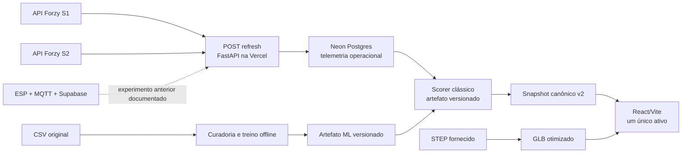

# Forzy TwinOps — monitoramento real e deploy demonstrativo sem custo

| Campo | Valor |
| --- | --- |
| Classificação | Arquitetural |
| Responsável de produto | Luis |
| Repositório | `9luis7/forzy-twinops` |
| Branch-base | `main` |
| Data | 2026-08-13 |
| Status | Aprovado em conversa; aguardando revisão deste documento |

## 1. Decisão executiva

O próximo recorte do Forzy TwinOps será um demonstrador técnico enxuto, baseado
somente no conjunto motor-bomba e nas duas fontes S1/S2 fornecidas pela Forzy.
Ele será publicável na Vercel, usará Postgres Neon no plano gratuito e fará
atualização sob demanda enquanto a interface estiver aberta. Não haverá
substituição silenciosa por mock, replay ou CSV quando a fonte real estiver
indisponível.

O sistema demonstrará integração real, observabilidade, persistência de
telemetria e detecção de desvio relativo ao histórico. Ele não prometerá
monitoramento contínuo, diagnóstico mecânico, probabilidade de falha, vida útil
remanescente ou antecedência de falha comprovada.

Esta especificação substitui, para o produto publicável, o desenho de
`2026-08-12-forzy-twinops-demonstrador-preditivo-design.md`. O documento anterior
permanece como registro da jornada e das decisões que levaram ao protótipo
atual.

## 2. Evidências e restrições conhecidas

### 2.1 Ativo e sensores

- Os materiais fornecidos representam um único conjunto motor-bomba.
- Nenhum documento fornecido contém uma TAG oficial do ativo.
- O código `VIM32PL-E1AC8-0RE-IO-1V1401` identifica o modelo do sensor
  Pepperl+Fuchs, não o ativo monitorado.
- A posição física e o eixo de medição de S1 e S2 não foram confirmados.
- O sensor calcula velocidade de vibração RMS e aceleração RMS em janela interna
  de aproximadamente dois segundos. A API não expõe sinal bruto ou espectro.

O identificador interno alvo será `forzy-motor-01`. A interface exibirá
`Conjunto motor-bomba monitorado` e `TAG não fornecida`. O identificador interno
não será apresentado como TAG industrial.

### 2.2 CSV histórico

- O CSV original possui 7.183 linhas e produz 14.366 leituras ao separar S1 e
  S2.
- O período cobre menos de quatro horas de um único dia.
- Há milhares de payloads consecutivos repetidos.
- Não existem rótulos de falha, manutenção, causa, carga, RPM ou resultado de
  inspeção.

O CSV será usado somente no pipeline offline de curadoria, treinamento,
backtest e auditoria do modelo. Ele não será importado no banco de produção da
demo nem usado como fallback visual para aparentar telemetria ao vivo.

### 2.3 API Forzy

Cada endpoint devolve um único objeto com `Velocidade`, `Aceleração` e
`Temperatura`. A API não devolve timestamp de aquisição, sequência, unidade,
qualidade, identidade do ativo ou frequência de atualização.

As semânticas adotadas são:

- `Velocidade`: velocidade de vibração RMS em `mm/s`, inferida da ficha técnica;
- `Aceleração`: valor em `g`, com estatística ainda não confirmada pela API;
- `Temperatura`: valor em `°C`, inferido da ficha técnica;
- `observedAt`: sempre nulo enquanto a fonte não fornecer horário de aquisição;
- `receivedAt`: horário em que o TwinOps recebeu a resposta, nunca chamado de
  horário de medição.

O endpoint estava acessível fora da janela informada de segunda a quarta, das
12h às 14h. Portanto, a janela será tratada como expectativa de atualização,
não como garantia de disponibilidade. Repetir uma requisição não prova que uma
nova medição foi produzida.

## 3. Objetivos

1. Exibir somente o ativo real fornecido e remover entidades, métricas e
   narrativas fictícias do produto.
2. Integrar S1 e S2 por uma fronteira server-side validada e auditável.
3. Mostrar última resposta real, horário de recebimento, qualidade temporal e
   saúde da integração sem confundir ausência com zero.
4. Persistir as respostas obtidas durante o uso para formar uma pequena
   tendência operacional real.
5. Executar o scorer de ML clássico sobre a janela recente e explicar que o
   resultado representa desvio relativo ao baseline histórico.
6. Exibir o modelo 3D derivado do STEP fornecido, sem inventar montagem ou
   posição dos sensores.
7. Publicar frontend, backend e persistência em uma arquitetura demonstrativa
   de custo zero dentro dos limites dos planos gratuitos.
8. Manter decisões, limitações e resultados rastreáveis para o storytelling do
   pitch.

## 4. Fora do escopo

- Monitoramento autônomo 24x7.
- Cron subminuto ou worker sempre ativo na Vercel Hobby.
- Garantia de tempo real, SLA industrial ou uso como sistema de proteção.
- Classificação de falha mecânica, RUL ou probabilidade de falha.
- Aprendizado online ou retreinamento automático.
- LLM, SLM, RAG, documentos, ordens de serviço e copiloto nesta entrega.
- Multiativo, multiplanta, usuários, permissões ou autenticação corporativa.
- Histórico completo do CSV na interface operacional.
- Marcadores de S1/S2 no 3D antes da confirmação física.
- Integração em runtime com o protótipo ESP/MQTT/Supabase anterior.

## 5. Arquitetura alvo



### 5.1 Fronteiras

- **Frontend:** apresenta o snapshot canônico. Não chama `trycloudflare.com`,
  não calcula severidade e não possui gerador de dados.
- **Refresh gateway:** consulta S1/S2, valida o payload, registra tentativa e
  resposta e produz um novo snapshot.
- **Repositório:** preserva leituras e tentativas; não conhece componentes de UI
  nem lógica de ML.
- **Scorer:** recebe uma janela canônica e devolve avaliação estruturada. Não
  acessa diretamente a API Forzy.
- **Treinamento offline:** usa o CSV original e produz artefato imutável com
  hashes, configuração e período de treinamento.
- **3D:** é um recurso visual estático servido pela CDN. Não participa da
  inferência nem afirma simulação física.

## 6. Identidade e contrato

O contrato público alvo será versionado como `2.0` porque a remoção da TAG
fictícia altera a identidade do domínio. `assetTag` será substituído por:

```json
{
  "assetId": "forzy-motor-01",
  "displayName": "Conjunto motor-bomba monitorado",
  "officialTag": null
}
```

O contrato v2 terá dois horários distintos por canal:

- `observedAt`: nulo para a fonte Forzy atual;
- `receivedAt`: horário UTC registrado pelo gateway.

O estado temporal também será explícito:

- `received_now`: o gateway acabou de receber uma resposta válida;
- `last_known`: a resposta exibida veio do banco após falha ou ausência de
  atualização;
- `expected_idle`: fora da janela declarada pela Forzy;
- `unavailable`: não há leitura real persistida;
- `source_freshness_unknown`: a origem não permite provar a idade da medição.

`received_now` não significa que o sensor acabou de medir. Por isso o snapshot
sempre carregará `source_freshness_unknown` enquanto não houver timestamp na
origem.

## 7. API e fluxo sob demanda

### 7.1 Rotas

- `POST /api/v2/assets/{assetId}/refresh`: faz uma tentativa de atualização,
  persiste resultados válidos, executa o scorer e devolve o snapshot.
- `GET /api/v2/assets/{assetId}/snapshot`: lê o último estado persistido, sem
  chamar a Forzy e sem causar escrita.
- `GET /api/v2/assets/{assetId}/history`: devolve apenas a tendência operacional
  coletada pelo TwinOps, com limite e janela curtos.
- `GET /api/v2/integration/health`: informa último intento, último sucesso,
  latência e erro por sensor.

O uso de `POST` separa claramente a operação com efeito colateral da leitura
idempotente do snapshot.

### 7.2 Ciclo do frontend

1. Ao abrir o painel, o frontend lê o último snapshot.
2. Enquanto a página estiver visível **e a janela declarada pela Forzy estiver
   aberta**, solicita refresh no intervalo inicial de cinco segundos,
   configurável server-side.
3. O gateway consulta S1 e S2 em paralelo, com timeout curto e isolamento entre
   sensores.
4. Cada resposta válida é persistida, mesmo se o outro sensor falhar.
5. Payload repetido é auditado, mas não contado como nova informação para
   features de tendência.
6. O scorer usa a janela recente disponível e devolve `insufficient_data` se a
   cobertura ou qualidade não for suficiente.
7. Ao ocultar ou fechar a página, ou ao encerrar a janela de atualização, o
   polling do navegador para.

O intervalo de cinco segundos é uma escolha operacional provisória. Ele não
afirma a cadência do sensor e poderá ser aumentado se a Forzy documentar rate
limit ou frequência inferior. Fora da janela, `POST refresh` não consulta o
upstream: devolve o último snapshot com `refreshAttempted: false` e estado
`expected_idle`. Consultas externas fora da janela ficam restritas ao smoke
test técnico separado da interface.

### 7.3 Coletor local opcional

O CLI de coleta poderá usar a mesma interface de repositório e gravar no Neon
durante sessões autorizadas. Ele é útil para acumular dados quando o painel não
está aberto, mas não é requisito para executar a demo na Vercel. Sua execução
e dependência do computador local deverão aparecer claramente como modo de
captura experimental, não como serviço de produção.

## 8. Persistência

SQLite continuará válido apenas para desenvolvimento e testes locais. Na
Vercel, o sistema usará Neon Postgres porque o filesystem de uma Function não é
a fonte persistente adequada para telemetria.

O banco armazenará:

- tentativas de coleta por sensor;
- payload bruto e hash;
- leitura canônica validada;
- horário de recebimento;
- avaliação e versão do modelo, quando produzidas.

O CSV original, features de treino e backtests permanecem fora do banco da
demo. O volume esperado é compatível com o plano gratuito e não exige Redis,
fila, banco time-series ou política automática de retenção nesta fase.

## 9. Machine learning

O artefato atual de baseline robusto será o primeiro modelo publicado. Ele foi
ajustado localmente com o CSV real e será carregado em modo somente leitura pelo
backend.

O resultado terá a semântica obrigatória
`relative_to_historical_baseline_not_failure_probability`. A UI poderá mostrar:

- estado normal, atenção, alerta ou dados insuficientes;
- score de anomalia relativo;
- score de deterioração relativo;
- persistência do desvio;
- evidências numéricas e limitações.

Não poderá mostrar “falha prevista”, percentual de chance de falha ou tempo
restante. O modelo não será executado continuamente: cada refresh bem-sucedido
gera ou atualiza a avaliação usando a janela real persistida.

## 10. Interface operacional

A primeira tela publicável terá somente:

- identidade honesta do único conjunto;
- modelo 3D interativo com rotação e zoom;
- valores atuais de S1 e S2;
- horário de recebimento e estado temporal por canal;
- tendência curta formada apenas com leituras coletadas pelo TwinOps;
- avaliação do modelo e evidências;
- saúde da integração.

Serão removidos da navegação e do runtime os ativos, plantas, TAGs, alarmes,
ordens, documentos, KPIs e narrativas inventados. Replay e mock não serão
fallback de produção. Se WebGL ou GLB falhar, o fallback será uma representação
estática honesta do mesmo conjunto, sem dados operacionais simulados.

O GLB deverá ser derivado do STEP fornecido, otimizado para web e acompanhado
de manifesto verificável. O DWG não é necessário para esta primeira entrega.

## 11. Tratamento de falhas

- **S1 falha e S2 responde:** S2 é persistido; S1 mantém o último valor real com
  estado `last_known`; avaliação global fica `insufficient_data` se depender dos
  dois canais.
- **Ambos falham:** o backend devolve o último snapshot real com erro de
  integração. Se não houver dado persistido, retorna `unavailable`.
- **Payload inválido:** registra tentativa e código de erro, preserva raw quando
  for seguro e não transforma o valor em zero.
- **Banco indisponível:** refresh falha explicitamente; o frontend não inventa
  snapshot normal.
- **Modelo indisponível ou incompatível:** telemetria continua visível e a
  avaliação fica indisponível.
- **Fora da janela:** não há polling automático; a última leitura permanece
  visível com `expected_idle` e horário de recebimento.
- **API lenta:** timeout e no máximo um retry curto; o frontend não mantém
  requisições concorrentes do mesmo ciclo.

## 12. Segurança e custo

- Base URL Forzy, string de conexão e hashes do modelo ficam em variáveis
  server-side da Vercel.
- O navegador acessa somente rotas same-origin.
- Não haverá chave de LLM nem envio de dados industriais a terceiros nesta
  entrega.
- O projeto será configurado para os limites gratuitos de Vercel Hobby e Neon
  Free; exceder cotas deve interromper ou degradar a demo, nunca gerar cobrança
  automática não aprovada.
- A arquitetura não usa Vercel Cron porque o plano Hobby permite apenas uma
  execução diária e sem precisão adequada ao polling.
- O deploy gratuito é um ambiente de demonstração sem SLA. Uso comercial ou
  operacional exige revisar termos, cotas e plano.

## 13. Testes e aceite

### 13.1 Contrato e unidade

- Validar fixtures v2 válidas e inválidas.
- Garantir que zero continue sendo medição válida.
- Rejeitar string, nulo indevido, booleano, NaN e infinito.
- Garantir `officialTag: null`, `observedAt: null` e separação de
  `received_now`/`source_freshness_unknown`.
- Confirmar que payload repetido não vira nova informação para tendência.

### 13.2 Integração

- Stub de S1/S2 para sucesso, falha parcial, timeout, 500 e JSON inválido.
- Persistência e leitura reais em Postgres de teste.
- Refresh idempotente por ciclo e sensores isolados.
- Carregamento do artefato com hashes fixados.
- Avaliação insuficiente quando a janela não satisfizer cobertura/qualidade.

### 13.3 Frontend

- Nenhuma rota ou tela apresenta ativos fictícios.
- O navegador nunca chama o hostname Forzy diretamente.
- Falha da API mostra último dado real e seu estado, nunca replay.
- Página oculta interrompe refresh periódico.
- Dados S1/S2, tendência, saúde e avaliação derivam do mesmo snapshot.
- Falha de 3D usa fallback do mesmo conjunto.

### 13.4 E2E e deploy

- Preview Vercel conectado a banco de teste ou branch isolada do Neon.
- Fluxo completo: abrir painel, atualizar S1/S2 via stub controlado, persistir,
  pontuar e renderizar.
- Smoke manual separado contra os endpoints reais.
- Validação de cold start, timeout, ausência de segredo no bundle e consumo das
  cotas gratuitas.

## 14. Critérios de sucesso

1. A URL da Vercel abre uma interface com um único ativo e nenhuma entidade
   fictícia.
2. Durante a janela declarada, uma resposta real válida de S1 ou S2 aparece no
   painel com horário de recebimento em até dois ciclos de refresh.
3. Indisponibilidade da Forzy é visível e não produz dado sintético.
4. A pequena tendência contém apenas observações coletadas pelo sistema.
5. O modelo carregado na Vercel produz avaliação reproduzível e claramente
   rotulada como desvio relativo.
6. O 3D usa geometria derivada do material fornecido e não inventa sensores.
7. Frontend, backend e banco funcionam dentro da arquitetura gratuita durante a
   apresentação.
8. Documentação e interface declaram que a fonte atual não permite comprovar
   frescor, antecedência de falha ou SLA.

## 15. Evolução posterior

Quando a Forzy fornecer URL estável, autenticação, timestamp de aquisição,
cadência, rate limit e eventos de falha/manutenção, a mesma fronteira canônica
poderá receber coleta contínua. Nesse estágio será possível avaliar worker
sempre ativo, features de maior resolução, rotulagem supervisionada e métricas
como precisão, recall, falso alerta e lead time.

LLM/SLM, RAG e assistência ao técnico permanecem uma camada posterior, fora do
caminho crítico da detecção. Eles deverão explicar uma avaliação estruturada,
nunca decidir o estado do ativo.

## 16. Decisões congeladas para o plano

- Um único ativo: `forzy-motor-01`.
- Sem TAG oficial inventada.
- Refresh sob demanda enquanto o painel estiver visível e dentro da janela
  declarada pela Forzy.
- Neon Postgres no deploy; SQLite somente local/teste.
- CSV somente para treino, backtest e auditoria.
- Baseline clássico atual como primeiro artefato publicado.
- Sem mock ou replay no runtime publicável.
- Sem LLM/SLM nesta entrega.
- 3D derivado do STEP, sem posição inventada de sensores.
- Limitações da API visíveis na interface e na jornada.

## 17. Decomposição da execução

O plano de implementação deverá manter cinco pacotes com gates claros:

1. **Contrato e identidade v2:** introduzir `assetId`, fixtures e adapters;
   remover a TAG fictícia da fronteira pública.
2. **Dados e ML publicáveis:** implementar Postgres, refresh sob demanda,
   health, histórico curto e carregamento do artefato.
3. **Interface de ativo único:** remover mocks e áreas fictícias; conectar a UI
   exclusivamente ao snapshot v2.
4. **Twin 3D real:** converter e otimizar o STEP, criar manifesto e integrar o
   fallback honesto.
5. **Deploy e prova integrada:** configurar Vercel/Neon, variáveis, preview,
   testes E2E e smoke real separado.

Os pacotes 2 e 4 podem avançar em paralelo depois do contrato v2. O pacote 3
depende do contrato e pode usar fixtures reais controladas até o backend estar
integrado. O deploy final só começa após os gates de contrato, dados, UI e 3D.

## 18. Referências externas verificadas

- [FastAPI na Vercel](https://vercel.com/docs/frameworks/backend/fastapi)
- [Limites e preços de Cron Jobs](https://vercel.com/docs/cron-jobs/usage-and-pricing)
- [Plano Vercel Hobby](https://vercel.com/docs/plans/hobby)
- [Neon Free e evolução para produção](https://neon.com/faqs/postgres-services-free-to-production)
