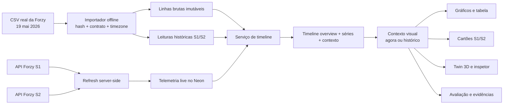

# Forzy TwinOps — linha do tempo unificada e twin 3D interativo

| Campo | Valor |
| --- | --- |
| Classificação | Arquitetural |
| Responsável de produto | Luis |
| Ativo | `forzy-motor-01` |
| Data | 2026-08-22 |
| Branch de desenho | `luis/real-twinops-integration` |
| Status | Direção aprovada em conversa; aguardando revisão deste documento |

## 1. Decisão executiva

O TwinOps passará a apresentar uma única linha do tempo operacional para o
conjunto motor-bomba. Nela, o histórico real do CSV fornecido pela Forzy será
exibido antes das leituras recentes coletadas pela API e persistidas no Neon.
As duas origens continuarão separadas por proveniência e qualidade temporal; a
interface não interpolará a lacuna entre elas nem insinuará que houve
monitoramento durante o intervalo sem dados.

O usuário poderá operar em dois contextos:

- **Agora:** mostra o último snapshot real da API/Neon e continua recebendo
  atualizações permitidas pelo fluxo operacional atual.
- **Histórico:** fixa um instante escolhido e sincroniza cartões S1/S2,
  gráficos, avaliação e twin 3D com o contexto daquele instante.

O modelo 3D deixará de ser um sólido cinza uniforme. O CAD atual permite
diferenciar e selecionar quatro grupos rastreáveis — motor, bomba, acoplamento
e base — e aplicar materiais PBR, iluminação, sombras, contorno, foco de câmera
e isolamento visual. Alertas continuarão vinculados ao ativo ou ao sensor que
os produziu, nunca a uma peça mecânica sem evidência.

Esta especificação substitui duas decisões do documento
`2026-08-13-forzy-twinops-real-vercel-zero-cost-design.md`:

1. o CSV real poderá ser importado no banco da aplicação como histórico
   operacional imutável e auditável;
2. a interface poderá apresentar esse histórico junto das leituras recentes.

Permanecem válidas as proibições de mock/replay disfarçado, de continuidade
temporal inventada, de diagnóstico mecânico não comprovado e de posicionamento
físico fictício de S1/S2.

## 2. Valor para a Forzy

O desenho atende diretamente aos objetivos declarados no material do desafio:

- guardar dados históricos brutos;
- mostrar valores atuais e evolução temporal;
- navegar pelo ativo monitorado;
- evidenciar desvios operacionais;
- transformar um conjunto CAD em uma interface de inspeção compreensível.

Para a demonstração, a linha do tempo resolve o problema de um banco recente
ainda pouco povoado sem substituir dado ausente por simulação. Ela mostra o que
de fato já foi medido em maio, o que passou a ser coletado recentemente e o que
o TwinOps não observou entre esses períodos.

O twin 3D faz sentido quando funciona como uma superfície de investigação: ele
deve orientar o usuário pelo conjunto, refletir o instante selecionado e abrir
evidências. Um modelo apenas decorativo não cumpre esse papel.

## 3. Evidência disponível

### 3.1 Histórico Forzy

- O CSV original contém 7.183 linhas e produz 14.366 leituras canônicas ao
  separar S1 e S2.
- O arquivo cobre 19 de maio de 2026, aproximadamente de 11:46:10 a 15:43:14
  no relógio local presente no CSV.
- O arquivo não informa offset ou timezone. A importação usará explicitamente
  `America/Sao_Paulo` como hipótese de interpretação e conservará o texto
  original do timestamp.
- O SHA-256 conhecido do CSV é
  `f09a6613bf6ba3416555a15de6b381bd842474f5f3f33c20660416c7164f0be4`.
- Existem 8.562 repetições consecutivas, 5.804 novas observações e 204 ciclos
  operacionais segmentados por gaps maiores que 15 s no material de auditoria.
  Todas as linhas serão preservadas;
  repetição não será contada automaticamente como nova informação para
  features ou avaliação.
- O CSV não contém rótulos de falha, manutenção, causa, carga ou inspeção.

### 3.2 Dados recentes

- O backend v2 persiste leituras reais da API em `telemetry_samples_v2` e
  mantém o último valor por sensor em `latest_readings_v2`.
- `GET /api/v2/assets/{assetId}/history` já permite filtrar por intervalo e
  sensor, mas devolve apenas telemetria live e no máximo 500 itens.
- O snapshot v2 ainda embute até 1.000 leituras por sensor. A interface usa esse
  array para um gráfico apenas de velocidade RMS; a fonte frontend já possui
  `getHistory`, mas o provider não o chama.
- A API não fornece timestamp de origem. Para as leituras live,
  `observedAt = receivedAt` e a qualidade continua
  `assumed_from_retrieval`.

### 3.3 CAD e modelo web

- O STEP fornecido tem hash fixado no manifesto e foi convertido em um GLB de
  17 sólidos, 63 primitivas e aproximadamente 4,5 mil triângulos.
- O manifesto particiona todos os 17 nós, sem sobreposição, em:
  `motor` (7), `pump` (3), `coupling` (5) e `base` (2).
- Essa partição foi derivada de nomes do arquivo fonte e é útil para navegação,
  mas ainda não equivale a uma validação de engenharia dos componentes.
- O GLB atual não contém materiais, texturas, imagens, UVs, animações, câmeras
  ou skins. A aparência cinza uniforme é uma limitação real do asset, agravada
  pelo runtime que hoje aplica um único material a todo o conjunto.
- A seleção por sólido é tecnicamente possível. O raycast atinge uma malha
  filha; o resolvedor deve subir a árvore até um nome exato presente em
  `manifest.nodes` e somente então chamar `nodeGroup`. Associação por prefixo,
  substring ou fuzzy match é proibida.
- Os nomes e grupos identificam volumes CAD, não componentes internos como
  rotor, estator, rolamento ou impulsor.

### 3.4 Sensor

O material original disponível fora do Git identifica o sensor Pepperl+Fuchs
`VIM32PL-E1AC8-0RE-IO-1V1401`:

- corpo em aço inoxidável AISI 303 / 1.4305;
- aproximadamente 72,5 mm de comprimento e 23,8 mm de diâmetro;
- conector M12 e massa aproximada de 100 g;
- IO-Link 1.1;
- velocidade de vibração RMS de 0 a 128 mm/s;
- aceleração de 0 a 10 g;
- temperatura de -40 a 85 °C;
- banda de 10 a 1.000 Hz, amostragem interna de 8 kHz e média RMS de 2 s.

O material não confirma onde S1 e S2 estão instalados, o eixo de medição, o
método de montagem ou qual grupo CAD corresponde a cada ponto.

Os arquivos originais STEP, DWG e PDFs permanecem fora do repositório. Esta
especificação não autoriza copiá-los ou versioná-los; eventual inclusão exige
decisão explícita sobre propriedade, licença e escopo.

## 4. Objetivos

1. Exibir histórico CSV e telemetria recente em uma única linha do tempo
   navegável, sem perder a origem de cada ponto.
2. Tornar a ausência de dados entre segmentos visível e semanticamente
   honesta.
3. Permitir selecionar um instante passado e reproduzir o contexto operacional
   daquele instante em cartões, gráficos, avaliação e twin 3D.
4. Preservar todos os registros importados e tornar a importação determinística,
   idempotente, transacional e verificável por hash.
5. Evitar carregar milhares de leituras dentro do snapshot inicial.
6. Transformar o 3D em uma ferramenta de navegação por grupo CAD, com materiais
   e iluminação de qualidade, sem inventar geometria ou semântica mecânica.
7. Representar o modelo de sensor com fidelidade dimensional em um inspetor
   separado, sem posicionar S1/S2 no ativo antes da validação da Forzy.
8. Manter o produto acessível e útil quando WebGL, histórico, modelo ML ou uma
   das fontes estiver indisponível.

## 5. Fora do escopo

- Preencher ou interpolar a lacuna entre maio e as coletas recentes.
- Afirmar que o ativo ficou parado, normal ou em falha nos intervalos sem dado.
- Renomear candidatos de desvio como falha confirmada.
- Inferir rolamento, rotor, estator, impulsor, selo ou causa mecânica a partir
  dos 17 sólidos atuais.
- Posicionar ou animar S1/S2 sobre o motor ou a bomba sem coordenadas e eixo
  validados.
- Simular vibração mecânica, deformação, CFD, FEA ou movimento físico.
- Fazer upload público de CSV, STEP, DWG ou datasheets.
- Usar datasets NASA/XJTU como histórico operacional da Forzy.
- Executar migração ou importação no banco de produção sem gate operacional
  separado.

## 6. Arquitetura alvo



### 6.1 Separação de responsabilidades

- **Importador:** lê um arquivo local explicitamente informado, valida hash e
  conteúdo, produz linhas brutas e leituras históricas; não chama a API e não
  faz deploy.
- **Persistência histórica:** armazena um arquivo importado como lote imutável.
  Não reutiliza as tabelas live nem altera `latest_readings_v2`.
- **Persistência live:** mantém o fluxo v2 atual e continua sendo a única fonte
  do estado “agora”.
- **Serviço de timeline:** projeta ambas as fontes em um contrato de leitura
  comum, calcula segmentos e lacunas de disponibilidade e aplica redução de
  pontos declarada.
- **Snapshot:** continua dedicado ao estado atual. O scorer poderá consultar
  sua janela interna no backend, mas o `snapshot.history` público será reduzido
  a no máximo 50 leituras por sensor como cauda de compatibilidade e o gráfico
  novo não dependerá dela.
- **Contexto visual:** escolhe entre o snapshot live e um contexto histórico
  fixado, sem permitir que refresh em background mova o cursor do usuário.
- **Twin 3D:** apresenta o contexto escolhido; não calcula score nem associa
  sensor a peça.

## 7. Persistência e importação do CSV

### 7.1 Novas tabelas

O histórico ficará separado das tabelas operacionais existentes:

1. `historical_import_batches_v1`
   - `batch_id`, `asset_id`, nome lógico da fonte, SHA-256, quantidade de linhas,
     quantidade esperada de leituras, timezone assumido, versão do parser,
     versão do contrato, instante da importação, status e manifesto canônico;
   - bytes exatos do arquivo, tamanho, encoding, delimitador e estilo de newline,
     guardados como fonte imutável e nunca expostos pela API pública.
2. `historical_raw_rows_v1`
   - `batch_id`, `record_ordinal` de 1 a 7.183, número físico da linha no
     arquivo, offsets no blob-fonte, timestamp lexical original, projeção
     parseada canônica e hash dos bytes da linha.
3. `historical_samples_v1`
   - `reading_id`, `batch_id`, `record_ordinal`, número físico da linha,
     `sample_pair_id`, `operating_cycle_id`, `asset_id`, `sensor_id`,
     `observed_at`, medições, flags de qualidade, hash e JSON canônico.
4. `historical_assessments_v1`
   - avaliação opcional por janela histórica, com sensor,
     `operating_cycle_id`, `window_start`, `window_end`, `assessment_at`,
     `anchor_point_id`, artefato/modelo, hashes, qualidade, evidências e
     semântica explícita de candidato de desvio.
5. `collection_policies_v1`
   - política versionada de coleta live, com timezone, dias/janela, polling
     esperado, limiar de gap, início/fim de vigência e hash da configuração;
   - refresh cycles futuros referenciam a política vigente. Registros antigos
     sem política não recebem classificação retroativa de coleta perdida.

`status` aceita somente `staged`, `active` ou `superseded`; falha antes do commit
não publica linha de lote. Somente lotes completos são persistidos como
`staged`. A ativação usa um
comando separado, `activate-history`, que recebe `batch_id` e o lote ativo
esperado. Sob lock transacional por ativo, ele revalida manifesto/contagens,
move o ativo atual para `superseded` e promove o alvo para `active`. Um índice
parcial único garante no máximo um lote ativo por `asset_id`; divergência,
concorrência ou interrupção preserva o estado anterior.

O mesmo contrato de repositório será implementado em SQLite para desenvolvimento
local e em PostgreSQL para preview/produção. O parser histórico v1 existente
pode fornecer funções já testadas, mas não poderá gravar diretamente no schema
v2 nem inventar campos live; sua saída deve passar pelos novos contratos.

### 7.2 Contrato histórico

O contrato live v2 não será afrouxado: `CanonicalSensorReadingV2` continuará
aceitando apenas `forzy-live`. A importação usará um tipo histórico próprio para
não falsificar `receivedAt` nem `sourceTimestampProvided`.

Os novos contratos históricos e de timeline terão a mesma matriz estrita em
JSON Schema, Pydantic e JavaScript. As três implementações deverão aceitar os
casos históricos/live válidos e rejeitar combinações de proveniência e tempo
incoerentes.

Cada leitura histórica conservará:

- `sourceKind: historical_archive`;
- `sourceSystem: forzy-csv`;
- `eventAt`: timestamp do CSV interpretado em `America/Sao_Paulo` e persistido
  em UTC;
- `sourceTimestampText`: valor lexical original;
- `timestampQuality: source_without_offset_assumed_timezone`;
- `ingestedAt`: instante da importação, distinto de `eventAt`;
- SHA do arquivo, lote, ordinal do registro, linha física e hash da linha;
- as mesmas três grandezas e unidades usadas na fronteira operacional;
- flags como `unchanged_from_previous` sem eliminar a leitura.

### 7.3 Identidade e idempotência

O `batch_id` será derivado de `asset_id`, SHA do arquivo, versão do parser,
timezone assumido e versão do contrato. Cada `reading_id` será determinístico a
partir de `batch_id + record_ordinal + sensor_id`.

`sample_pair_id` identifica o par S1/S2 de uma única linha do CSV e será
determinístico por `batch_id + record_ordinal`; no live, será derivado do
refresh cycle persistido. `operating_cycle_id` é outra identidade: agrupa
sequências separadas por gaps maiores que 15 s e deve reproduzir os 204 ciclos
do CSV usados pelo walk-forward. Os dois conceitos não podem compartilhar nome
ou valor.

A primeira versão do importador aceitará somente o perfil registrado
`forzy-history-2026-05-19-v1`, com hash, cabeçalho e contagens exatos. Um novo
arquivo exige novo perfil versionado; não existe modo genérico que aceite
qualquer CSV por conveniência.

A importação completa ocorrerá em uma transação:

1. verificar arquivo regular, tamanho, hash e encoding esperado;
2. validar cabeçalho, 7.183 linhas e valores finitos;
3. provar ordenação temporal e converter timestamps sem normalização silenciosa;
4. gerar 7.183 linhas brutas e 14.366 leituras S1/S2;
5. validar o manifesto e todos os hashes antes da publicação;
6. guardar os bytes exatos da fonte e inserir o lote `staged` e suas
   dependências atomicamente;
7. reler contagens e hashes do banco antes de declarar sucesso.

Reexecutar o mesmo arquivo com a mesma configuração deve ser um no-op que
revalida o lote existente. Erro, interrupção ou divergência não pode deixar um
lote ativo parcial. O blob-fonte torna possível reconstruir byte a byte o
arquivo validado; a projeção parseada não será chamada de “bruto”.

### 7.4 Política do arquivo original

O CSV não será empacotado no frontend nem servido por rota pública. O importador
receberá um path absoluto por CLI e um hash esperado. Preview e produção terão
operações de importação separadas, cada uma condicionada a aprovação e a um
relatório sanitizado de contagens/hashes.

## 8. Contrato da linha do tempo

Será criada uma projeção `TimelinePointV1`, comum apenas para leitura visual.
Ela não substitui os contratos canônicos de ingestão.

Campos essenciais:

```json
{
  "schemaVersion": "1.0",
  "pointId": "uuid-v5",
  "samplePairId": "uuid-v5",
  "operatingCycleId": "uuid-v5-or-null",
  "assetId": "forzy-motor-01",
  "sensorId": "s1",
  "eventAt": "2026-05-19T14:46:10.921Z",
  "sourceKind": "historical_archive",
  "timestampQuality": "source_without_offset_assumed_timezone",
  "measurements": {},
  "qualityFlags": [],
  "provenance": {
    "sourceSystem": "forzy-csv",
    "batchId": "sha256:...",
    "sourceFileSha256": "sha256:...",
    "recordOrdinal": 1,
    "sourceLineNumber": 2
  }
}
```

O JSON acima é ilustrativo do shape, mas o timestamp preserva a precisão da
primeira amostra conhecida. `pointId`, `samplePairId` e, quando presente,
`operatingCycleId` são UUIDv5 determinísticos.

`measurements` não é um objeto livre: contém exatamente
`vibrationVelocityRms` (`mm/s`), `vibrationAcceleration` (`g`, estatística
`unknown`) e `temperature` (`degC`), cada qual com número finito e confiança
semântica. Um `TimelinePointV1` representa uma leitura existente e, portanto,
não usa `null`; ausência aparece como canal nulo em `TimelineContextV1`.

Para live, `sourceKind` será `live_collection`, `sourceSystem` será
`forzy-api` e a proveniência explicará que o evento usa horário de recebimento.

### 8.1 Respostas, ordem e limites

Quatro schemas fechados serão versionados em JSON Schema, Pydantic e JS:

- `TimelinePointV1`: leitura e proveniência;
- `TimelineOverviewV1`: cobertura, segmentos, lacunas, séries,
  `eventCandidates` ancorados em pontos originais e agregação;
- `TimelinePageV1`: pontos originais, `nextCursor`, `hasMore` e fingerprint da
  query;
- `TimelineContextV1`: ponto-âncora, `channels.s1/s2`, avaliação e limitações.

`from` é inclusivo e `to` é exclusivo. Sem intervalo, o overview cobre do
primeiro ponto do lote histórico ativo ao último ponto live. A ordem total é
`eventAt ASC, samplePairId ASC, sensorId ASC, pointId ASC`.

O cursor é opaco e vinculado ao lote ativo e ao fingerprint de filtros/ordem;
cursor de outra consulta ou de lote superseded recebe 409. A página bruta usa
`limit=200` por padrão e máximo 500. A série usa `maxPoints=1200` por combinação
sensor/origem por padrão, mínimo 40 e máximo 4.000. Métricas válidas são somente
as três do contrato.

Timestamp sem timezone, intervalo vazio/invertido, métrica/sensor inválido e
limites excedidos retornam 422. Lote ausente retorna overview live-only com
capacidade histórica desabilitada, não erro 500.

Se fontes ou lotes se sobrepuserem temporalmente, nenhum ponto é deduplicado
entre origens. A proveniência continua visível e a ordem total acima torna o
resultado determinístico. Somente o lote histórico `active` participa da
timeline pública.

### 8.2 Rotas

- `GET /api/v2/assets/{assetId}/timeline`
  - devolve limites, segmentos, lacunas, candidatos de desvio e séries
    reduzidas;
  - filtros: `from`, `to`, `sensorId`, `metric` e `maxPoints`;
  - não causa escrita nem chama a Forzy.
- `GET /api/v2/assets/{assetId}/timeline/samples`
  - devolve pontos originais paginados por cursor estável;
  - usado pela tabela/auditoria e por zoom detalhado.
- `GET /api/v2/assets/{assetId}/timeline/context`
  - aceita exatamente uma forma: `pointId=...` para um ponto original exato, ou
    `at=...&segmentId=...` para navegação contínua;
  - na segunda forma, o backend consulta os pontos originais, não a série
    reduzida, e escolhe pela ordem total o maior `eventAt <= at` dentro do
    segmento, respeitando o limiar de gap;
  - resolve o `samplePairId` do ponto-âncora e devolve as leituras S1/S2 do mesmo
    par, a avaliação causal disponível naquele instante e proveniência;
  - ausência de um sensor permanece ausente, nunca vira zero ou carry-forward
    silencioso.

A rota `/history` atual permanece compatível durante a transição, mas deixa de
ser a fonte do gráfico principal.

`capabilities.replayControls` permanecerá `false`: ele identifica o replay
sintético legado, não a navegação por dados reais. A disponibilidade da timeline
será declarada pelo contrato próprio, sem rebatizar uma capacidade antiga.

### 8.3 Segmentos e lacunas

Cada segmento declarará `segmentId`, origem, início/fim inclusivos, quantidade
total e por sensor, qualidade temporal, lote/fonte e hipóteses. Cada lacuna
declarará início/fim exclusivos, tipo, regra que a produziu e duração.

As regras ficam congeladas:

- quando `archiveEnd < firstLive`: `source_discontinuity` no intervalo aberto;
  se as fontes se sobrepuserem, não existe gap entre elas e ambas permanecem;
- dentro do CSV: `archive_sampling_gap` quando ciclos consecutivos distarem
  mais de 15 segundos;
- dentro de uma janela live esperada: `live_expected_collection_gap` quando a
  distância exceder o `gapThresholdSeconds` da `collectionPolicy` persistida;
- fora de seg/ter/qua, 12h–14h em `America/Sao_Paulo`: `expected_idle`, não
  falha de cobertura.

A política inicial `forzy-live-window-v1` registra polling esperado de 5 s,
limiar de gap de 15 s e a agenda acima. Alterar qualquer valor cria outra
versão com nova vigência; reconsultar dados antigos nunca usa a configuração
runtime atual para reclassificá-los.

A área entre o último ponto do CSV e o primeiro ponto live será renderizada
como:

> Sem dados disponíveis ao TwinOps neste intervalo.

Essa faixa não significa que o ativo estava parado ou sem anomalia. O texto de
toda lacuna será sobre cobertura de dados, nunca sobre estado físico. A linha
do gráfico é quebrada em cada gap; `expected_idle` usa tratamento visual
próprio e não é contado como coleta perdida.

### 8.4 Redução de pontos

O banco preservará todos os pontos. Para cada combinação sensor/origem com mais
de `maxPoints`, o backend aplicará obrigatoriamente
`time_bucket_envelope_v1`:

1. resolve `[from,to)` efetivo e cria
   `bucketCount = floor(maxPoints / 4)` buckets de duração igual, ancorados em
   `from`; o último termina exatamente em `to`;
2. em cada bucket não vazio seleciona primeiro, mínimo, máximo e último ponto;
3. empates de mínimo/máximo escolhem o primeiro pela ordem total do contrato;
4. seleções com o mesmo `pointId` são deduplicadas;
5. o resultado é reordenado pela ordem total e contém no máximo `maxPoints`.

Se a série couber no orçamento, devolve todos os pontos originais e declara
`method: none`. A resposta também informa:

- método;
- quantidade original e retornada;
- intervalo e métrica;
- se existem pontos omitidos.

Ao aproximar o zoom, o frontend refaz a consulta com intervalo menor até chegar
a pontos originais. Média isolada é insuficiente porque pode esconder picos.

## 9. Avaliação histórica e alertas

O artefato live atual declara `trainedUntil=2026-05-19T17:40:14.229Z`, enquanto
o CSV começa antes desse horário. Portanto, reaplicar esse artefato final ao
início do arquivo usaria informação futura e é proibido como contexto histórico
causal.

Os marcadores do CSV virão exclusivamente da avaliação **walk-forward**
versionada e auditável:

1. cada fold treina somente com ciclos operacionais cujo fim é anterior ao
   começo da janela avaliada;
2. a avaliação registra `foldId`, `operatingCycleId`, início/fim da janela de
   treino, `windowStart`, `windowEnd`, `assessmentAt`, `anchorPointId`, hash da
   configuração/modelo do fold e hash do relatório de backtest;
3. resultados existentes no relatório versionado serão revalidados contra o
   lote ativo ou reproduzidos com o mesmo protocolo antes da publicação;
4. as duas desigualdades são obrigatórias:
   `trainingEnd < windowStart` e `windowEnd <= anchor.eventAt`;
5. pontos anteriores ao fim da janela, ou sem fold causal válido, recebem
   `assessment: null`, não resultado agregado futuro nem inferência
   retrospectiva do modelo final.

O artefato final continua sendo usado no fluxo live conforme seu contrato
atual. Janelas de qualquer avaliação são confinadas a um único segmento e
origem: o processo não concatena o fim do CSV com o início live nem atravessa
uma lacuna como se as amostras fossem contínuas.

Os resultados históricos deverão registrar hashes e sua semântica pública será
sempre:

- `normal` → “normal”;
- `watch` → “atenção”;
- `alert` → “alerta”;
- `insufficient_data` → “dados insuficientes”;
- `event_candidate` → “candidato de desvio”;
- nunca “falha confirmada”, “causa”, “probabilidade de falha” ou “RUL”.

O CSV participou da construção e avaliação dos baselines walk-forward. A
interface deve explicar essa relação para não apresentar o histórico como
validação externa independente.

`componentTag` permanece nulo. Um alerta de S1 ou S2 pode realçar o contorno do
ativo inteiro e o rail do sensor correspondente, mas não pode tornar motor,
bomba ou acoplamento “culpado”.

## 10. Estado do frontend

O provider será dividido em estado live e estado de navegação:

```text
liveSnapshot        último snapshot obtido
timelineOverview    segmentos, lacunas e séries do intervalo
viewMode            now | historical
selectedAt          instante fixado ou null
selectedPointId     ponto/par de amostras escolhido ou null
historicalContext   contexto retornado para selectedAt
selectedSensor      s1 | s2 | all
selectedGroup       motor | pump | coupling | base | null
```

### 10.1 Regras

- A aplicação inicia em `now`.
- Selecionar um ponto ou marcador faz o cursor encaixar naquele ponto, muda
  para `historical` e fixa todos os painéis no mesmo par de amostras.
- Ao mover o cursor entre pontos, o provider consulta
  `context?at=&segmentId=`. O backend escolhe o maior `eventAt <= selectedAt`
  entre pontos originais. Se o intervalo ultrapassar o limiar de gap da origem,
  não há âncora e o contexto fica indisponível. Busca bidirecional pelo ponto
  “mais próximo” e resolução apenas sobre pontos reduzidos são proibidas.
- Atualizações live podem continuar em background, mas não movem o cursor nem
  substituem os valores históricos em exibição.
- Se chegar nova leitura durante a inspeção histórica, aparece “novo dado
  disponível”; o botão **Voltar para agora** restaura o snapshot live.
- Refresh manual no modo histórico não altera o contexto selecionado.
- A URL poderá conservar intervalo e instante selecionado em query params sem
  incluir segredos ou payloads.
- Falha da timeline não apaga o último snapshot live.

## 11. Experiência da linha do tempo

A área histórica terá:

- um overview proporcional ao calendário, no qual a duração da lacuna não é
  encurtada nem escondida;
- um gráfico de detalhe com janela focada, inicialmente no segmento live em
  “Agora” e no segmento do cursor em “Histórico”;
- atalhos **Histórico de maio**, **Dados recentes** e **Ver período completo**;
- seletor de métrica: velocidade RMS, aceleração e temperatura;
- filtros S1, S2 ou ambos;
- presets de intervalo e zoom/pan;
- bandas de proveniência visualmente distintas para CSV e live;
- faixa de lacuna explícita;
- cursor sincronizado e tooltip com timestamp, origem, qualidade e valor;
- marcador visível quando existir apenas um ponto;
- contagem original/visível quando houver redução;
- tabela acessível dos pontos do intervalo;
- marcadores de candidatos de desvio com legenda semântica.

O gráfico não conectará linhas através de lacunas nem entre fontes. As cores de
sensor e de estado não serão o único meio de distinção.

O overview prova a relação temporal real; o gráfico de detalhe mantém cada
segmento legível apesar dos meses sem observação. Um eventual eixo quebrado só
poderá existir como modo opcional, com marcador de quebra e duração omitida
escrita no próprio eixo — nunca como padrão silencioso.

## 12. Twin 3D: evolução visual suportada agora

### 12.1 Materiais e iluminação

O manifesto evoluirá para incluir metadados de apresentação por grupo CAD,
sem alterar o inventário de nós. Presets iniciais:

- **motor:** perfil ilustrativo azul, de baixa metalicidade;
- **bomba:** perfil ilustrativo escuro, fosco e rugoso;
- **acoplamento:** perfil ilustrativo claro, de maior metalicidade;
- **base:** perfil ilustrativo grafite, fosco.

São presets de legibilidade, não confirmação de cor, liga, ferro fundido, aço,
pintura ou acabamento do equipamento real. Cada grupo registrará
`semanticConfidence: inferred_from_source_name`, regra de origem e
`presentationConfidence: illustrative`. Em particular, `coupling` foi inferido
pela regra do conversor sobre nomes A/B/C, não por um componente explicitamente
rotulado no STEP. Fotos ou documentação de engenharia são necessárias para
elevar a confiança.

O renderer usará `MeshStandardMaterial`, ambiente de estúdio gerado localmente
ou asset versionado, luz principal/preenchimento, sombras de contato, plano de
solo discreto e contornos. Nenhum recurso de runtime dependerá de CDN externa.

Como o GLB não possui UVs, a primeira evolução não usará fotografia aplicada à
malha. Mapas de textura, decalques e placas exigem novo asset com UV e direito
de uso comprovado.

### 12.2 Interação

- hover com contorno e cursor;
- clique/toque para selecionar grupo;
- lista HTML equivalente e operável por teclado;
- foco de câmera em motor, bomba, acoplamento ou base;
- isolar grupo e deixar os demais translúcidos, sem alterar geometria;
- botão de restaurar vista isométrica;
- painel com nome do grupo CAD, quantidade de sólidos, nomes fonte e limitações;
- opção **Mostrar sólidos CAD**, com arestas e IDs individuais; um sólido pode
  ser realçado, mas continua rotulado “sem semântica mecânica validada”;
- modo de dimensões com envelope geral e bounding box calculada por grupo,
  declarados como medidas do CAD e não tolerâncias de fabricação;
- persistência da seleção ao trocar entre agora e histórico;
- estado global do ativo visível por halo/contorno e legenda, preservando a cor
  base de cada material.

O resolvedor de clique deverá encontrar um ancestral com nome exatamente igual
a um item de `manifest.nodes`. Qualquer nó desconhecido não será selecionável e
produzirá diagnóstico sanitizado.

### 12.3 Relação com tempo e alertas

O twin recebe o mesmo `displayContext` dos cartões e do gráfico:

- em **Agora**, representa o último estado live;
- em **Histórico**, mostra data/hora, origem e avaliação do cursor;
- sem avaliação, permanece neutro e exibe “dados insuficientes”;
- alerta de sensor destaca o rail S1/S2 e o ativo inteiro;
- nenhum grupo mecânico recebe status causal sem `componentTag` validado.

### 12.4 Inspetor do sensor VIM32

Será criado um modelo simples e dimensionalmente rastreável do VIM32, limitado
ao envelope e ao contorno documentados: corpo cilíndrico, comprimento/diâmetro
e volume externo do conector. Passo de rosca, contatos internos, logotipo,
acabamento exato e detalhes não cotados não serão inventados. Ele aparecerá em
um **inspetor de sensor** ou dock separado quando S1/S2 for selecionado.

O inspetor exibirá modelo, faixa, unidade, frequência, tecnologia e limitações.
Ele usará a mensagem:

> Representação dimensional do modelo de sensor. Posição de S1/S2 no conjunto
> ainda não validada.

O sensor não será colocado sobre a geometria principal nesta fase.

### 12.5 Fallback

O fallback estático será regenerado com a nova composição visual e manterá a
mesma proveniência do STEP. Ele continuará acompanhado dos dados e controles
HTML; falhar WebGL não pode tornar histórico, valores ou alertas inacessíveis.

## 13. Fidelidade física condicionada a nova evidência

Detalhamento interno ou réplica visual exata só será liberado quando houver:

1. fotos ortogonais e gerais do conjunto real;
2. placas e fabricante/modelo do motor, com potência, tensão e rotação;
3. fabricante/modelo da bomba, curva, desenho e tipo de impulsor;
4. desenho ou identificação do acoplamento e da proteção;
5. CAD ou corte explodido com rotor, estator, rolamentos, eixo, selo e impulsor;
6. posição, eixo, orientação e método de montagem de S1 e S2;
7. TAG oficial do ativo;
8. autorização para versionar ou derivar assets desses documentos.

Esses itens formam um **gate de evidência**, não um bloqueio da primeira
evolução visual. Até sua satisfação, a UI poderá dizer “grupo CAD do motor”,
mas não “rolamento dianteiro” ou “sensor no mancal”.

## 14. Performance e acessibilidade

- Three.js continuará lazy-loaded.
- O renderer usará `frameloop="demand"` quando compatível com os controles.
- DPR permanecerá limitado e sombras terão orçamento definido.
- Materiais serão clonados e descartados sem vazar GPU.
- O perfil de referência será versionado em
  `artifacts/twin3d/performance-profile.json`, com CPU, GPU, driver, OS,
  Playwright/Chromium, viewport, DPR, hashes do modelo e versão do script. Sem
  esse arquivo, o gate de performance não pode ser declarado aprovado.
- A medição espera `data-model-ready=true`, aquece por 3 s e executa três vezes
  a mesma órbita automatizada. Em cada run, coleta timestamps de
  `requestAnimationFrame` por 10 s e long tasks via `PerformanceObserver`. FPS é
  `1000 / mediana(frameDeltaMs)`; o pior dos três runs deve ser pelo menos 30
  FPS e não ter long task do twin acima de 200 ms.
- O modelo e o sensor não dependerão de assets remotos.
- `prefers-reduced-motion` desabilitará pulsos, transições de câmera e qualquer
  animação decorativa, sem remover a interação 3D.
- Seleção e contexto existirão em controles HTML, com foco visível, labels e
  anúncio de mudança; o canvas não será a única interface.
- A timeline terá tabela alternativa e navegação por teclado.

## 15. Tratamento de falhas

- **Importação inválida:** transação abortada; lote anterior permanece ativo.
- **Hash ou contagem divergente:** falha fechada antes da ativação.
- **Timeline indisponível:** snapshot live continua utilizável e a UI informa
  que o histórico não pôde ser carregado.
- **Um sensor ausente no cursor:** mostra indisponível; não copia o outro sensor
  e não usa último valor sem rótulo explícito.
- **Avaliação histórica ausente:** não gera marcador nem estado normal falso.
- **Novo live durante inspeção histórica:** indica disponibilidade sem mover o
  cursor.
- **Manifesto/GLB falha:** usa fallback estático e mantém seleção/timeline em
  HTML.
- **Material ou grupo desconhecido:** aplica preset neutro e registra warning;
  não faz associação aproximada.
- **Erro transitório de asset 3D:** boundary deve poder se recuperar quando o
  asset/contexto mudar, sem exigir reload total da página.

## 16. Segurança, proveniência e custo

- CSV e documentos originais não entram no bundle.
- O browser acessa somente rotas same-origin.
- O importador é CLI administrativo; não será criado endpoint público de
  upload nesta fase.
- Logs não incluirão DSN, paths locais completos nem conteúdo bruto sensível.
- A importação registra hashes, parser, timezone e contagens suficientes para
  reprodução.
- O volume de 14.366 leituras é pequeno para o Neon atual, mas consultas sempre
  terão índices, intervalo e limite.
- Histórico não será duplicado a cada deploy.
- Migração e importação em preview precedem qualquer ação em produção.
- Importar histórico não altera `latest_readings_v2`, `effective_now`, estado
  operacional, saúde, contagem de coleta live ou refresh cycles.

Antes de qualquer escrita não efêmera por migration/import, exigem:

1. `--environment local|preview|production` explícito, sem default;
2. fingerprint esperado de projeto/branch/database/schema, calculado sem
   registrar DSN, host ou usuário em claro;
3. leitura de `deployment_identity_v1` com label e fingerprint correspondentes;
4. migration version esperada e schema sem drift;
5. dry-run completo do arquivo e consulta read-only das contagens/lote ativo.

Mismatch falha antes de `BEGIN`. A criação inicial de
`deployment_identity_v1` também requer fingerprint esperado e aprovação do gate
de migração. O relatório mostra somente ambiente, fingerprint hash, versões,
contagens e resultado sanitizado.

Em `local`, o alvo SQLite deve ser path absoluto resolvido dentro da worktree ou
de diretório temporário criado pelo processo, com fingerprint de path+schema e
flag `--allow-local-write`. Em preview/produção, a identidade vem do banco
remoto. Bancos efêmeros criados pela suíte permanecem isolados pelo fixture e
não usam a CLI administrativa.

## 17. Estratégia de testes

### 17.1 Importador e persistência

- RED/GREEN para cabeçalho, encoding, timestamp, NaN/infinito, contagem e hash.
- 7.183 linhas brutas e 14.366 leituras no arquivo real opt-in.
- reconstrução byte a byte do CSV a partir do blob e offsets persistidos.
- IDs determinísticos e reexecução idempotente.
- paridade de comportamento entre SQLite e PostgreSQL.
- rollback para `Exception`, `KeyboardInterrupt` e `SystemExit` onde aplicável.
- lote divergente não substitui lote ativo.
- duas ativações concorrentes mantêm exatamente um lote ativo por asset.
- `asset_id` diferente produz identidade de lote diferente.
- PostgreSQL real de teste para constraints, índices e concorrência.
- fingerprint/environment incorreto falha antes da primeira escrita.

### 17.2 API

- união ordenada de archive/live sem misturar proveniência;
- matrizes JSON Schema/Pydantic/JS aceitam os mesmos casos e rejeitam os mesmos
  cruzamentos falsos de fonte/tempo;
- lacuna explícita entre segmentos;
- regras do policy versionado, gap de 15 s do CSV e `expected_idle` são
  reproduzidas literalmente; registros live sem policy não são reclassificados;
- timestamps CSV com hipótese de timezone preservada;
- paginação estável sem perda/duplicação;
- percorrer todas as páginas devolve cada leitura exatamente uma vez;
- redução preserva primeiro, último, mínimos e máximos;
- candidato de desvio permanece visível mesmo quando seu ponto não integra a
  série reduzida;
- zoom chega a pontos originais;
- contexto não faz carry-forward silencioso;
- contexto entre pontos só usa `eventAt <= selectedAt` e respeita gap;
- ponto original omitido pelo downsampling ainda é escolhido corretamente pelo
  endpoint de contexto;
- sobreposição entre fontes preserva ambos os pontos e ordem total;
- fold histórico satisfaz `trainingEnd < assessmentWindow.start` e
  `assessmentWindow.end <= anchor.eventAt`;
- snapshot público contém no máximo 100 frames de compatibilidade, enquanto a
  janela interna do scorer é consultada separadamente;
- rotas GET não causam escrita nem chamam upstream.

### 17.3 Frontend

- inicia em agora e alterna para histórico por cursor;
- cartões, gráfico, avaliação e twin compartilham o mesmo instante;
- refresh em background não move contexto histórico;
- “Voltar para agora” restaura o último snapshot live;
- ponto único, valor zero, métrica ausente e lacuna possuem estados visíveis;
- overview proporcional e atalhos de foco mantêm CSV e live legíveis;
- falha de histórico preserva o snapshot;
- tabela e teclado cobrem a mesma informação visual.

### 17.4 Twin 3D

- manifesto particiona exatamente os 17 nós;
- resolução de seleção usa ancestral e nome exato;
- materiais diferem por grupo e não são substituídos por uma cor global;
- materiais/grupos continuam marcados como ilustrativos/inferidos;
- seleção, foco, isolar/restaurar e fallback possuem teste;
- alerta sem `componentTag` nunca colore um grupo como causador;
- S1/S2 permanecem fora da geometria principal;
- inspetor do VIM32 declara posição não validada;
- reduced motion mantém modelo interativo e remove movimento decorativo;
- E2E em navegador real prova modelo carregado, não apenas presença de canvas.

### 17.5 Visual e deploy

- screenshots de normal, atenção, alerta, dados insuficientes, histórico e
  fallback;
- preview com banco isolado e lote CSV importado por operação autorizada;
- probes GET para snapshot, timeline, contexto, manifesto, GLB e PNG;
- nenhum POST refresh no smoke read-only;
- teste de interação 3D usa o perfil versionado, Windows 11, Chromium fixado
  pelo Playwright, viewport 1366×768 e `deviceScaleFactor=1`, reproduzindo
  warm-up, três runs, cálculo rAF e long tasks definidos na seção 14;
- produção continua um gate separado.

## 18. Critérios de aceite

1. A tela abre em “Agora” e mostra o último dado live disponível.
2. O overview exibe CSV e live em escala temporal proporcional; o gráfico de
   detalhe oferece foco legível em cada segmento, com origem visual e textual.
3. A lacuna entre os segmentos não possui linha conectando valores e informa
   que o TwinOps não tem dados para o intervalo.
4. Selecionar um instante histórico sincroniza S1, S2, avaliação, evidências e
   estado visual do twin.
5. O usuário volta ao snapshot live com uma ação inequívoca.
6. Os bytes exatos do CSV, os 7.183 registros parseados e os 14.366 pontos
   canônicos são auditáveis no banco, com hash e importação idempotente.
7. O gráfico nunca esconde picos por média simples e informa quando reduziu
   pontos.
8. Motor, bomba, acoplamento e base têm aparência distinguível, seleção exata,
   foco de câmera e painel próprio.
9. O sensor VIM32 possui representação dimensional separada e não aparece
   instalado no conjunto.
10. Nenhum texto ou cor atribui falha a uma peça sem evidência.
11. Falhar 3D ou histórico não impede visualizar os dados live.
12. A nova preview passa testes de contrato, banco, frontend, navegador real e
   acessibilidade antes de qualquer promoção.
13. `snapshot.history` não excede 50 frames por sensor e o scoring conserva sua
   janela interna sem serializá-la para o browser.
14. Nenhum marcador histórico usa um modelo treinado com dados posteriores à
   janela avaliada.

## 19. Fases de execução

### Fase A — contrato, migração e importação

- contratos históricos e de timeline;
- tabelas e índices;
- importador idempotente;
- prova local e em Postgres de teste.

### Fase B — timeline e contexto

- projeção archive/live;
- overview, séries, paginação e contexto;
- importação/reprodução determinística dos folds walk-forward históricos;
- preservação da compatibilidade v2.

### Fase C — experiência histórica

- provider com `now/historical`;
- gráfico multigrandeza, proveniência, lacunas, cursor e tabela;
- sincronização com cartões e avaliação.

### Fase D — twin 3D investigável

- manifesto de apresentação versionado;
- PBR, iluminação, solo, sombras e fallback renovado;
- seleção, foco, isolamento, painel e acessibilidade;
- inspetor dimensional do VIM32;
- sincronização com a linha do tempo.

As fases C e D podem avançar em paralelo depois dos contratos da Fase B. A
integração final exige que ambas consumam o mesmo `displayContext`.

### Fase E — preview e prova integrada

- migração do banco de preview;
- importação autorizada do CSV por hash;
- build/deploy da preview;
- smoke read-only, E2E visual e relatório de evidência;
- revisão independente do SHA e da URL.

### Fase F — fidelidade física adicional

- receber e registrar o pacote de evidência faltante;
- atualizar CAD/manifesto/UVs/materiais conforme dados reais;
- validar âncoras S1/S2 com a Forzy;
- só então introduzir hotspots físicos ou componentes internos.

## 20. Gates operacionais

1. **Gate de especificação:** aprovação explícita deste documento.
2. **Gate de plano:** plano executável derivado desta especificação e revisado.
3. **Gate de migração:** autorização para aplicar schema no banco de preview.
4. **Gate de importação:** confirmação do arquivo/hash e autorização para gravar
   o lote no preview.
5. **Gate de preview:** deploy e validação sem promoção automática.
6. **Gate de produção:** autorização separada para migração, importação e
   promoção.
7. **Gate de fidelidade:** evidências físicas antes de hotspots, internos,
   placas ou acabamento apresentados como reais.

## 21. Decisões congeladas para o plano

- Uma única linha do tempo, com fontes separadas por proveniência.
- CSV antes de live, sem interpolação e sem continuidade implícita.
- Tabelas históricas separadas das tabelas live.
- Snapshot continua representando “agora”; timeline é carregada sob demanda.
- Histórico bruto preservado; redução ocorre apenas na projeção de gráfico.
- `now/historical` controla toda a tela por um contexto único.
- Navegação histórica não reativa o replay sintético legado.
- Marcadores históricos são candidatos de desvio, não falhas.
- Quatro grupos CAD selecionáveis: motor, bomba, acoplamento e base.
- Materiais PBR melhoram leitura visual, mas permanecem não validados até fotos.
- S1/S2 não são colocados no ativo; VIM32 aparece em inspetor separado.
- Sem componentes internos inventados.
- Sem assets externos em CDN e sem versionar documentos originais sem aprovação.
- Preview antes de produção, com gates independentes de migração e importação.
